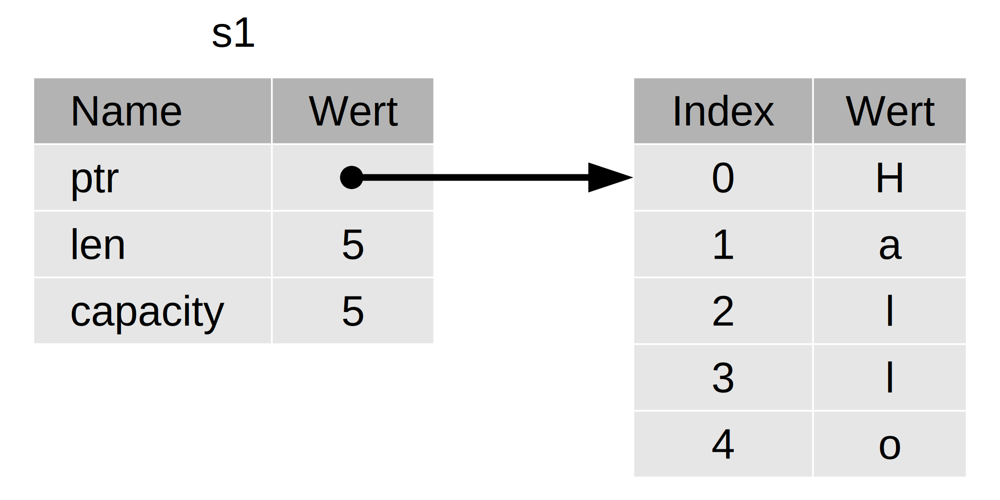
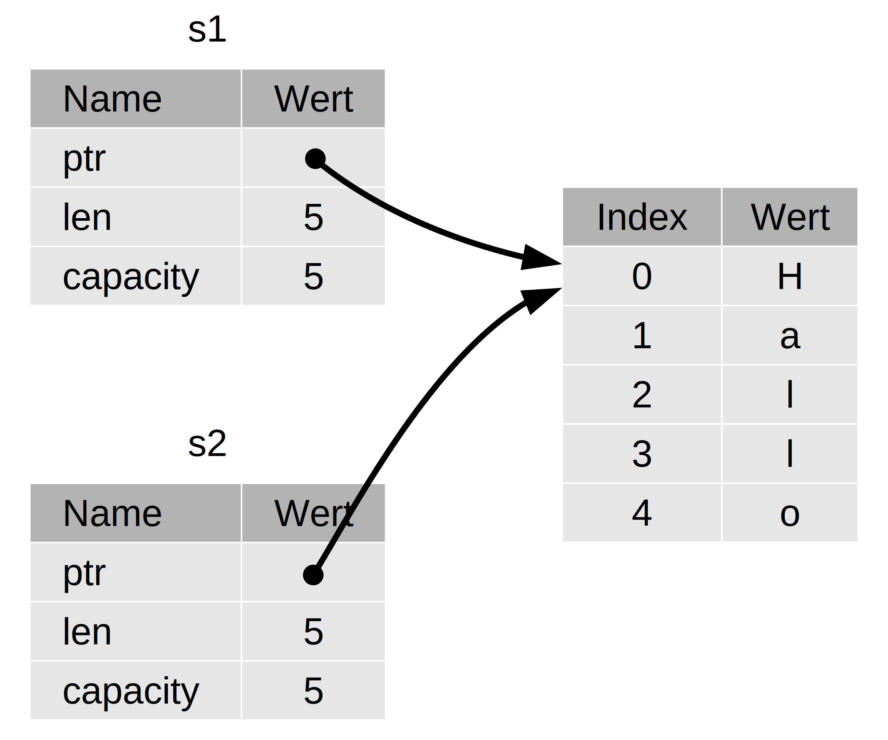
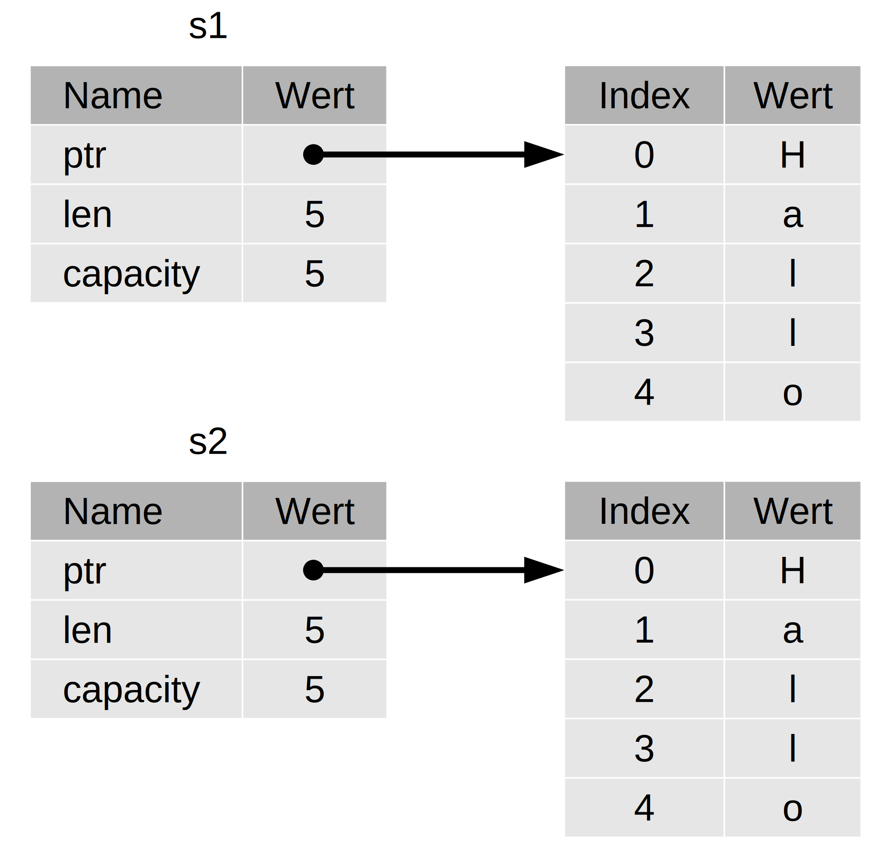
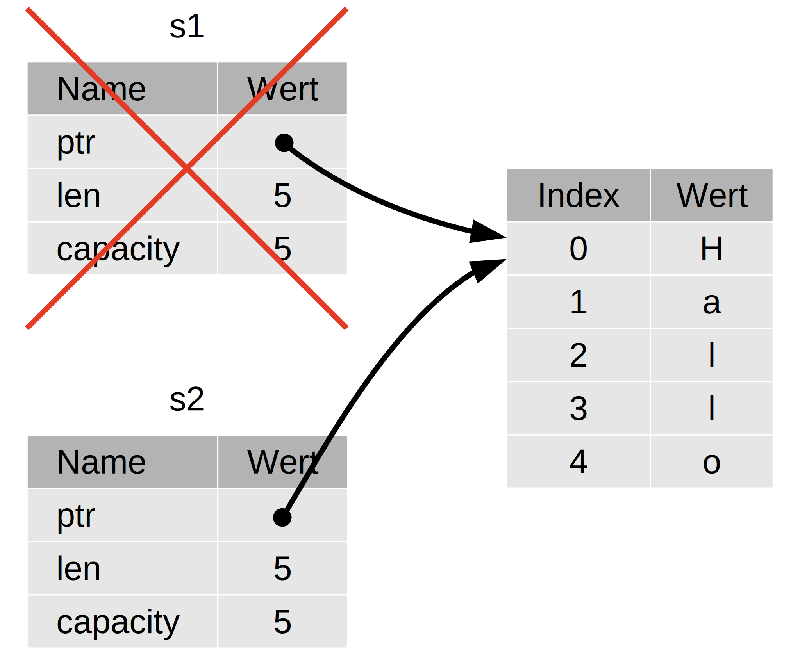

## Was ist Eigentümerschaft (ownership)?

Die zentrale Funktionalität von Rust ist *Eigentümerschaft* (ownership). Obwohl
diese Funktionalität einfach zu erklären ist, hat sie weitgehende Auswirkungen
auf den Rest der Sprache.

Alle Programme müssen den Arbeitsspeicher eines Rechners verwalten, während sie
ausgeführt werden. Einige Sprachen verfügen über eine automatische
Speicherbereinigung, die während der Programmausführung ständig nach nicht mehr
genutztem Speicher sucht. Bei anderen Sprachen muss der Programmierer selbst
den Speicher explizit reservieren und freigeben. Rust verwendet einen dritten
Ansatz: Der Speicher wird durch ein System aus Eigentümerschaft und einer Reihe
von Regeln verwaltet, die der Compiler zur Kompilierzeit überprüft. Keine
der Eigentümerschaftsfunktionalitäten verlangsamt dein Programm, während es
läuft.

Da die Eigentümerschaft für viele Programmierer ein neues Konzept ist, braucht
es etwas Zeit, sich daran zu gewöhnen. Die gute Nachricht ist, je mehr
Erfahrung du mit Rust und den Regeln der Eigentümerschaft gesammelt hast, desto
mehr kannst du auf natürliche Weise Code entwickeln, der sicher und effizient
ist. Bleib dran!

Wenn du Eigentümerschaft verstehst, hast du eine solide Grundlage, um die
Funktionalitäten zu verstehen, die Rust einzigartig machen. In diesem Kapitel
lernst du Eigentümerschaft kennen, indem du einige Beispiele durcharbeitest,
die sich auf eine sehr verbreitete Datenstruktur konzentrieren: Zeichenketten
(strings).

> ### Stapelspeicher (stack) und Haldenspeicher (heap)
>
> In vielen Programmiersprachen musst du nicht sehr oft über Stapelspeicher und
> Haldenspeicher nachdenken. Aber in einer Systemprogrammiersprache wie
> Rust hat die Frage, ob ein Wert auf dem Stapelspeicher oder im Haldenspeicher
> liegt, einen größeren Einfluss darauf, wie sich die Sprache verhält
> und warum du bestimmte Entscheidungen treffen musst. Teile der
> Eigentümerschaft werden später in diesem Kapitel in Bezug auf den
> Stapelspeicher und den Haldenspeicher beschrieben, daher hier eine
> kurze Erklärung zur Vorbereitung.
>
> Sowohl Stapelspeicher als auch Haldenspeicher sind Teile des
> Arbeitsspeichers, die deinem Code zur Laufzeit zur Verfügung stehen, aber sie
> sind unterschiedlich strukturiert. Der Stapelspeicher speichert Werte in der
> Reihenfolge, in der er sie erhält, und entfernt die Werte in umgekehrter
> Reihenfolge. Dies wird als *zuletzt herein, zuerst hinaus* (last in, first
> out) bezeichnet. Denke an einen Stapel Teller: Wenn du weitere Teller
> hinzufügst, legst du sie auf den Stapel, und wenn du einen Teller benötigst,
> nimmst du einen von oben. Das Hinzufügen oder Entfernen von Tellern aus der
> Mitte oder von unten würde nicht so gut funktionieren! Das Hinzufügen von
> Daten nennt man *auf den Stapel legen*, und das Entfernen von Daten nennt man
> *vom Stapel nehmen*.
>
> Alle im Stapelspeicher gespeicherten Daten müssen eine bekannte, feste Größe
> haben. Daten mit einer zur Kompilierzeit unbekannten Größe oder einer Größe,
> die sich ändern könnte, müssen stattdessen im Haldenspeicher
> gespeichert werden. Der Haldenspeicher ist weniger organisiert: Wenn du
> Daten in den Haldenspeicher legst, forderst du eine bestimmte Menge an
> Speicherplatz an. Der Speicher-Allokator (memory allocator) sucht eine leere
> Stelle im Haldenspeicher, die groß genug ist, markiert sie als in
> Benutzung und gibt einen *Zeiger* (pointer) zurück, der die Adresse dieser
> Stelle ist. Dieser Vorgang wird als *Allokieren im Haldenspeicher*
> bezeichnet und manchmal mit *Allokieren* abgekürzt. Das Legen von Werten auf
> den Stapelspeicher gilt nicht als Allokieren. Da es sich beim Zeiger um eine
> bekannte, feste Größe handelt, kannst du den Zeiger auf den Stapelspeicher
> legen, aber wenn du die eigentlichen Daten benötigst, musst du dem Zeiger
> folgen.
>
> Stell dir vor, du sitzt in einem Restaurant. Wenn du hineingehst, gibst du
> die Anzahl der Personen deiner Gruppe an, und das Personal findet einen
> leeren Tisch, der groß genug ist, und führt euch dorthin. Wenn jemand aus
> deiner Gruppe zu spät kommt, kann er fragen, wo ihr Platz genommen habt, um
> euch zu finden.
>
> Das Legen auf den Stapelspeicher ist schneller als das Allokieren im
> Haldenspeicher, da der Speicher-Allokator nie nach Platz zum Speichern
> neuer Daten suchen muss; dieser Ort ist immer ganz oben auf dem Stapel. Im
> Vergleich dazu erfordert das Allokieren von Speicherplatz im dynamischen
> Speicher mehr Arbeit, da der Speicher-Allokator zunächst einen ausreichend
> großen Platz für die Daten finden und dann Buch führen muss, um die nächste
> Allokation vorzubereiten.
>
> Der Zugriff auf Daten im Haldenspeicher ist langsamer als der Zugriff
> auf Daten auf dem Stapelspeicher, da du einem Zeiger folgen musst, um dorthin
> zu gelangen. Heutige Prozessoren sind schneller, wenn sie weniger im Speicher
> herumspringen. Um die Analogie fortzusetzen, betrachte einen Kellner in einem
> Restaurant, der an vielen Tischen Bestellungen aufnimmt. Es ist am
> effizientesten, alle Bestellungen an einem Tisch aufzunehmen, bevor man zum
> nächsten Tisch weitergeht. Eine Bestellung von Tisch A, dann eine Bestellung
> von Tisch B, dann wieder eine von A und dann wieder eine von B aufzunehmen,
> wäre ein viel langsamerer Vorgang. Umgekehrt kann ein Prozessor seine Arbeit
> besser erledigen, wenn er mit Daten arbeitet, die nahe beieinander liegen
> (wie sie auf dem Stapelspeicher liegen) und nicht weiter voneinander entfernt
> (wie sie im Haldenspeicher liegen können). Das Allokieren einer großen
> Menge an Platz im Haldenspeicher kann ebenfalls Zeit in Anspruch
> nehmen.
>
> Wenn dein Code eine Funktion aufruft, werden die an die Funktion übergebenen
> Werte (einschließlich potentieller Zeiger auf Daten im Haldenspeicher)
> und die lokalen Variablen der Funktion auf den Stapelspeicher gelegt. Wenn
> die Funktion beendet ist, werden diese Werte vom Stapelspeicher genommen.
>
> Das Nachverfolgen, welche Codeteile welche Daten im Haldenspeicher
> verwenden, das Minimieren der Menge an doppelten Daten im Haldenspeicher
> und das Aufräumen ungenutzter Daten im Haldenspeicher, damit
> dir der Speicherplatz nicht ausgeht, sind alles Probleme, die durch
> Eigentümerschaft gelöst werden. Wenn du Eigentümerschaft einmal verstanden
> hast, brauchst du nicht mehr so oft über Stapelspeicher und Haldenspeicher 
> nachzudenken. Aber zu wissen, dass die Verwaltung von Haldenspeicher-Daten
> der Grund für Eigentümerschaft ist, kann helfen zu erklären,
> warum es so funktioniert, wie es funktioniert.

### Eigentumsregeln

Lass uns zunächst einen Blick auf die Eigentumsregeln (ownership rules) werfen.
Behalte diese Regeln im Hinterkopf, während wir veranschaulichende Beispiele
durcharbeiten:

* Jeder Wert in Rust hat eine Variable, die als sein *Eigentümer* bezeichnet
  wird.
* Es kann immer nur einen Eigentümer zur gleichen Zeit geben.
* Wenn der Eigentümer den Gültigkeitsbereich verlässt, wird der Wert gelöscht.

### Gültigkeitsbereich (scope) einer Variable

Wir sind bereits in Kapitel 2 ein Beispiel für ein Rust-Programm durchgegangen.
Da wir nun über die grundlegende Syntax hinausgehen, werden wir nicht mehr den
gesamten `fn main() {`-Code in die Beispiele aufnehmen. Wenn du also
weitermachst, musst du die folgenden Beispiele manuell in eine Funktion `main`
einfügen. Folglich werden unsere Beispiele etwas prägnanter sein, damit wir uns
auf die eigentlichen Details konzentrieren können, anstatt auch den Code darum
herum betrachten zu müssen.

Als erstes Beispiel zu Eigentümerschaft werden wir uns den *Gültigkeitsbereich*
(scope) einiger Variablen ansehen. Der Gültigkeitsbereich ist der Bereich
innerhalb eines Programms, in dem ein Element gültig ist. Nehmen wir an, wir
haben eine Variable, die so aussieht:

```rust
let s = "Hallo";
```

Die Variable `s` bezieht sich auf ein Zeichenkettenliteral, wobei der Wert der
Zeichenkette fest in den Text unseres Programms kodiert ist. Die Variable ist
ab der Stelle, an der sie deklariert wurde, bis zum Ende des aktuellen
*Gültigkeitsbereichs* gültig. Codeblock 4-1 enthält Kommentare mit Anmerkungen,
wo die Variable `s` gültig ist.

```rust
{                      // s ist hier nicht gültig, es wurde noch nicht deklariert
    let s = "Hallo";   // s ist ab dieser Stelle gültig

    // etwas mit s machen
}                      // dieser Gültigkeitsbereich ist nun vorbei,
                       // und s ist nicht mehr gültig
```

<span class="caption">Codeblock 4-1: Eine Variable und der Bereich, in dem sie
gültig ist</span>

Mit anderen Worten, es gibt hier zwei wichtige Zeitpunkte:

* Wenn `s` *in den Gültigkeitsbereich* kommt, ist es gültig.
* Es bleibt gültig, bis es *den Gültigkeitsbereich* verlässt.

An diesem Punkt ist die Beziehung zwischen Gültigkeitsbereichen und wann
Variablen gültig sind ähnlich zu anderen Programmiersprachen. Nun werden wir
auf diesem Verständnis aufbauen, indem wir den Typ `String` einführen.

### Der Typ `String`

Um die Eigentumsregeln zu veranschaulichen, benötigen wir einen Datentyp, der
komplexer ist als die, die wir im Abschnitt [„Datentypen“][data-types] in
Kapitel 3 behandelt haben. Die zuvor behandelten Typen haben alle eine bekannte
Größe, können auf dem Stapelspeicher gelegt und vom Stapelspeicher entfernt
werden, wenn ihr Gültigkeitsbereich beendet ist, und können schnell und trivial
kopiert werden, um eine neue, unabhängige Instanz zu erzeugen, wenn ein anderer
Teil des Codes denselben Wert in einem anderen Gültigkeitsbereich verwenden
muss. Wir wollen uns jedoch Daten ansehen, die im Haldenspeicher gespeichert
sind, und untersuchen, woher Rust weiß, wann es diese Daten aufräumen muss.

Wir werden hier `String` als Beispiel nehmen und uns auf die Teile von `String`
konzentrieren, die sich auf die Eigentümerschaft beziehen. Diese Aspekte gelten
auch für andere komplexe Datentypen, unabhängig davon, ob sie von der
Standardbibliothek bereitgestellt oder von dir erstellt wurden. Wir werden
`String` in Kapitel 8 eingehender behandeln.

Wir haben bereits Zeichenkettenliterale gesehen, bei denen ein
Zeichenkettenwert fest in unserem Programm kodiert ist. Zeichenkettenliterale
sind praktisch, aber sie eignen sich nicht für jede Situation, in der wir Text
verwenden möchten. Ein Grund dafür ist, dass sie unveränderlich sind. Ein
anderer Grund ist, dass nicht jeder Zeichenkettenwert bekannt ist, wenn wir
unseren Code schreiben: Was ist zum Beispiel, wenn wir Benutzereingaben
entgegennehmen und speichern wollen? Für diese Situationen hat Rust einen
zweiten Zeichenkettentyp: `String`. Dieser Typ verwaltet Daten, die auf dem
Haldenspeicher allokiert sind, und kann so eine Textmenge speichern, die uns
zur Kompilierzeit unbekannt ist. Du kannst einen `String` aus einem
Zeichenkettenliteral erzeugen, indem du die Funktion `from` wie folgt
verwendest:

```rust
let s = String::from("Hallo");
```

Der doppelte Doppelpunkt (`::`) ist ein Operator, der es uns erlaubt, diese
spezielle Funktion `from` mit dem Namensraum des `String`-Typs zu benennen,
anstatt einen Namen wie `string_from` zu verwenden. Wir werden diese Syntax im
Abschnitt [„Methodensyntax“][method-syntax] in Kapitel 5 näher betrachten, und
wenn wir in Kapitel 7 unter [„Mit Pfaden auf ein Element im Modulbaum
verweisen“][paths-module-tree] über den Namensraum mit Modulen sprechen. 

Diese Art von Zeichenkette kann *verändert* werden:

```rust
let mut s = String::from("Hallo");

s.push_str(" Welt!"); // push_str() hängt ein Literal an eine Zeichenfolge an

println!("{}", s);    // Gibt `Hallo Welt!` aus
```

Was ist hier nun der Unterschied? Warum kann `String` verändert werden,
Literale jedoch nicht? Der Unterschied liegt darin, wie diese beiden Typen mit
dem Arbeitsspeicher umgehen.

### Speicher und Allokation

Im Falle eines Zeichenkettenliterals kennen wir den Inhalt zum Zeitpunkt der
Kompilierung, sodass der Text direkt in die endgültige ausführbare Datei fest
kodiert wird. Aus diesem Grund sind Zeichenkettenliterale schnell und
effizient. Allerdings ergeben sich diese Eigenschaften nur aus der
Unveränderlichkeit des Zeichenkettenliterals. Leider können wir nicht für jedes
Stück Text, dessen Größe zum Zeitpunkt der Kompilierung unbekannt ist und
dessen Größe sich während der Ausführung des Programms ändern könnte, einen
Speicherblock in die Binärdatei packen.

Um mit dem Typ `String` einen veränderlichen, größenänderbaren Textabschnitt zu
unterstützen, müssen wir Speicher im Haldenspeicher allokieren, dessen
Größe zur Kompilierzeit unbekannt ist. Dies bedeutet:

* Der Speicher muss zur Laufzeit vom Speicher-Allokator angefordert werden.
* Wir brauchen eine Möglichkeit, diesen Speicher an den Speicher-Allokator
  zurückzugeben, wenn wir mit unserem `String` fertig sind.

Der erste Teil wird von uns erledigt: Wenn wir `String::from` aufrufen, fordert
seine Implementierung den Speicher an, den sie benötigt. Dies ist in
Programmiersprachen ziemlich einheitlich.

Der zweite Teil ist jedoch anders. In Sprachen mit einer *automatischen
Speicherbereinigung* (garbage collector, GC) behält der GC den Überblick und
räumt Speicherplatz, der nicht mehr verwendet wird, auf; wir brauchen nicht
darüber nachzudenken. Ohne einen GC liegt es in unserer Verantwortung, zu
erkennen, wann Speicherplatz nicht mehr benutzt wird, und Code aufzurufen, der
ihn explizit zurückgibt, so wie wir es beim Anfordern auch getan haben. Dies
korrekt zu tun, war in der Vergangenheit ein schwieriges Programmierproblem.
Wenn wir es vergessen, verschwenden wir Speicher. Wenn wir es zu früh machen,
haben wir eine ungültige Variable. Wenn wir es zweimal machen, ist das auch ein
Fehler. Wir müssen eine *Allokierung* mit genau einer *Freigabe* paaren.

Rust geht einen anderen Weg: Der Speicher wird automatisch zurückgegeben,
sobald die Variable, die ihn besitzt, den Gültigkeitsbereich verlässt. Hier ist
eine Variante unseres Gültigkeitsbereich-Beispiels aus Codeblock 4-1, bei der
ein `String` anstelle eines Zeichenkettenliterals verwendet wird:

```rust
{
    let s = String::from("Hallo"); // s ist ab dieser Stelle gültig

    // etwas mit s machen
}                                  // dieser Gültigkeitsbereich ist nun vorbei,
                                   // und s ist nicht mehr gültig
```

Es gibt eine natürliche Stelle, an der wir den Speicher, den unser `String`
benötigt, an den Speicher-Allokator zurückgeben können: Wenn `s` den
Gültigkeitsbereich verlässt. Wenn eine Variable den Gültigkeitsbereich
verlässt, ruft Rust für uns eine spezielle Funktion auf: Diese Funktion heißt
[`drop`][drop-doc] und an dieser Stelle kann der Autor von `String` Code
einfügen, um den Speicher zurückzugeben. Rust ruft `drop` automatisch an der
schließenden geschweiften Klammer auf.

> Hinweis: In C++ wird dieses Muster der Freigabe von Ressourcen am Ende der
> Lebensdauer eines Elements manchmal als *Ressourcenbelegung ist
> Initialisierung* (resource acquisition is initialization, RAII) bezeichnet.
> Die Funktion `drop` in Rust wird dir vertraut vorkommen, wenn du bereits
> RAII-Muster verwendet hast.

Dieses Muster hat einen tiefgreifenden Einfluss auf die Art und Weise, wie
Rust-Code geschrieben wird. Es mag im Moment einfach erscheinen, aber das
Verhalten von Code kann in komplizierteren Situationen unerwartet sein, wenn
wir wollen, dass mehrere Variablen Daten verwenden, die wir im dynamischen
Speicher allokiert haben. Lass uns jetzt einige dieser Situationen untersuchen.

#### Wege, wie Variablen und Daten interagieren: Verschieben (move)

Mehrere Variablen können in Rust auf unterschiedliche Weise mit denselben Daten
interagieren. Betrachten wir ein Beispiel mit einer ganzen Zahl in Codeblock
4-2.

```rust
let x = 5;
let y = x;
```

<span class="caption">Codeblock 4-2: Zuweisen des ganzzahligen Wertes der
Variablen `x` an `y`</span>

Wir können wahrscheinlich erahnen, was das bewirkt: „Binde den Wert `5` an `x`;
dann erstelle eine Kopie des Wertes in `x` und binde ihn an `y`.“ Wir haben
jetzt zwei Variablen `x` und `y` und beide sind gleich `5`. Das ist in der Tat
der Fall, denn ganze Zahlen sind einfache Werte mit einer bekannten, festen
Größe, und diese beiden Werte `5` werden auf den Stapelspeicher gelegt.

Schauen wir uns nun die `String`-Variante an:

```rust
let s1 = String::from("Hallo");
let s2 = s1;
```

Dieser sieht dem vorherigen Code sehr ähnlich, sodass wir annehmen könnten,
dass die Funktionsweise die gleiche wäre: Das heißt, die zweite Zeile würde
eine Kopie des Wertes in `s1` erstellen und sie an `s2` binden. Aber das ist
nicht ganz das, was passiert.

Betrachte Abbildung 4-1, um zu sehen, was mit dem `String` unter der Haube
geschieht. Ein `String` besteht aus drei Teilen, die auf der linken Seite
dargestellt sind: Einem Zeiger auf den Speicherbereich, der den Inhalt der
Zeichenkette enthält, die Länge und die Kapazität. Dieser Datenblock wird auf
dem Stapelspeicher gespeichert. Auf der rechten Seite ist der Speicherbereich
im Haldenspeicher, der den Inhalt enthält.



<span class="caption">Abbildung 4-1: Speicherdarstellung eines `String` mit dem
Wert „Hallo“, gebunden an `s1`</span>

Die Länge gibt an, wie viel Speicherplatz in Bytes der Inhalt der Zeichenkette
derzeit belegt. Die Kapazität ist die Gesamtmenge des Speichers in Bytes, die
der `String` vom Speicher-Allokator erhalten hat. Der Unterschied zwischen
Länge und Kapazität ist von Bedeutung, aber nicht in diesem Zusammenhang,
deshalb ist es im Moment in Ordnung, die Kapazität zu ignorieren.

Wenn wir `s1` an `s2` zuweisen, werden die `String`-Daten kopiert, d.h. wir
kopieren den Zeiger, die Länge und die Kapazität, die sich auf dem
Stapelspeicher befinden. Wir kopieren nicht die Daten im Haldenspeicher,
auf die sich der Zeiger bezieht. Die Speicherdarstellung sieht also wie in
Abbildung 4-2 aus.



<span class="caption">Abbildung 4-2: Speicherdarstellung der Variable `s2`, die
eine Kopie des Zeigers, der Länge und der Kapazität von `s1` hat</span>

Die Darstellung sieht *nicht* wie Abbildung 4-3 aus, so wie der Speicher
aussehen würde, wenn Rust stattdessen auch die Daten im Haldenspeicher
kopieren würde. Würde Rust dies tun, könnte die Operation `s2 = s1` bei großen
Datenmengen im Haldenspeicher sehr teuer hinsichtlich der
Laufzeitperformanz werden.



<span class="caption">Abbildung 4-3: Eine weitere Möglichkeit für das, was
`s2 = s1` tun könnte, falls Rust auch die Daten im Haldenspeicher
kopieren würde</span>

Vorhin sagten wir, dass Rust automatisch die Funktion `drop` aufruft und den
Haldenspeicher für diese Variable säubert, wenn eine Variable den
Gültigkeitsbereich verlässt. Abbildung 4-2 zeigt jedoch, dass beide Datenzeiger
auf dieselbe Stelle zeigen. Das ist ein Problem: Wenn `s2` und `s1` den
Gültigkeitsbereich verlassen, werden beide versuchen, den gleichen Speicher
freizugeben.

Dies wird als *doppelter Freigabefehler* (double free error) bezeichnet und ist
einer der Speichersicherheitsfehler, die wir zuvor erwähnt haben. Das
zweimalige Freigeben des Speichers kann zu einer Speicherverfälschung führen,
was potenziell zu Sicherheitslücken führen kann.

Um Speichersicherheit zu gewährleisten, gibt es noch ein weiteres Detail, was
Rust in dieser Situation macht. Nach `let s2 = s1` betrachtet Rust `s1` als
nicht mehr gültig. Daher braucht Rust nichts freizugeben, wenn `s1` den
Gültigkeitsbereich verlässt. Schau dir an, was
passiert, wenn du versuchst, `s1` zu benutzen, nachdem `s2` erstellt wurde; es
wird nicht funktionieren:

```rust,does_not_compile
let s1 = String::from("Hallo");
let s2 = s1;

println!("{} Welt!", s1);
```

Du erhältst eine Fehlermeldung wie diese, wodurch Rust dich daran hindert, die
ungültige Referenz zu verwenden:

```console
$ cargo run
   Compiling ownership v0.1.0 (file:///projects/ownership)
error[E0382]: borrow of moved value: `s1`
 --> src/main.rs:5:28
  |
2 |     let s1 = String::from("Hallo");
  |         -- move occurs because `s1` has type `String`, which does not implement the `Copy` trait
3 |     let s2 = s1;
  |              -- value moved here
4 | 
5 |     println!("{} Welt!", s1);
  |                          ^^ value borrowed here after move

error: aborting due to previous error

For more information about this error, try `rustc --explain E0382`.
error: could not compile `ownership`

To learn more, run the command again with --verbose.
```

Wenn du beim Arbeiten mit anderen Sprachen schon mal die Begriffe *flache
Kopie* (shallow copy) und *tiefe Kopie* (deep copy) gehört hast, hört sich das
Konzept des Kopierens des Zeigers, der Länge und der Kapazität ohne Kopieren
der Daten nach einer flachen Kopie an. Aber weil Rust auch die erste Variable
ungültig macht, wird es nicht als flache Kopie, sondern als *Verschieben*
(move) bezeichnet. In diesem Beispiel würden wir sagen, dass `s1` in `s2`
*verschoben* wurde. Was tatsächlich geschieht, ist in Abbildung 4-4
dargestellt.




<span class="caption">Abbildung 4-4: Speicherdarstellung, nachdem `s1` ungültig
gemacht wurde</span>

Damit ist unser Problem gelöst! Da nur `s2` gültig ist, wenn es den
Gültigkeitsbereich verlässt, wird es allein den Speicher freigeben, und wir
sind fertig.

Darüber hinaus gibt es eine Entwurfsentscheidung, die damit impliziert ist:
Rust wird niemals automatisch „tiefe“ Kopien deiner Daten erstellen. Daher kann
man davon ausgehen, dass jedes *automatische* Kopieren im Hinblick auf die
Laufzeitperformanz kostengünstig ist.

#### Wege, wie Variablen und Daten interagieren: Klonen (clone)

Wenn wir die Daten von `String` im Haldenspeicher *tief* kopieren wollen,
nicht nur die Stapelspeicher-Daten, können wir eine gängige Methode namens
`clone` verwenden. Wir werden die Methodensyntax in Kapitel 5 besprechen, aber
da Methoden eine gängige Funktionalität vieler Programmiersprachen sind, hast
du sie wahrscheinlich schon einmal gesehen.

Hier ist ein Beispiel für die Methode `clone`:

```rust
let s1 = String::from("Hallo");
let s2 = s1.clone();

println!("s1 = {}, s2 = {}", s1, s2);
```

Das funktioniert sehr gut und erzeugt explizit das in Abbildung 4-3 gezeigte
Verhalten, bei dem die Daten im Haldenspeicher *kopiert* werden.

Wenn du einen Aufruf von `clone` siehst, weißt du, dass irgendein beliebiger
Code ausgeführt wird und dass dieser Code teuer sein könnte. Es ist ein
visueller Indikator dafür, dass etwas anderes vor sich geht.

#### Nur Stapelspeicher-Daten: Kopieren (copy)

Es gibt noch einen weiteren Kniff, über den wir noch nicht gesprochen haben.
Folgender Code mit ganzen Zahlen, der teilweise in Codeblock 4-2 gezeigt wurde,
funktioniert und ist gültig:

```rust
let x = 5;
let y = x;

println!("x = {}, y = {}", x, y);
```

Aber dieser Code scheint dem zu widersprechen, was wir gerade gelernt haben:
Wir haben keinen Aufruf von `clone`, aber `x` ist immer noch gültig und wurde
nicht in `y` verschoben.

Der Grund dafür ist, dass Typen wie ganze Zahlen, die zur Kompilierzeit eine
bekannte Größe haben, vollständig auf dem Stack gespeichert werden, so dass
Kopien der tatsächlichen Werte schnell erstellt werden können. Das bedeutet,
dass es keinen Grund gibt, warum wir verhindern wollen, dass `x` gültig ist,
nachdem wir die Variable `y` erstellt haben. Mit anderen Worten, es gibt hier
keinen Unterschied zwischen tiefen und flachen Kopien, also würde der Aufruf
`clone` nichts anderes tun als das übliche flache Kopieren, und wir können es
weglassen.

Rust hat eine spezielle Annotation, das Merkmal `Copy`, die wir an Typen wie
ganze Zahlen hängen können, die auf dem Stapelspeicher gespeichert sind (wir
werden in Kapitel 10 mehr über Merkmale sprechen). Wenn ein Typ das Merkmal
`Copy` hat, ist eine ältere Variable nach der Zuweisung noch verwendbar. Rust
lässt uns einen Typ nicht mit dem Merkmal `Copy` annotieren, wenn der Typ oder
einer seiner Teile das Merkmal `Drop` implementiert. Wenn der Typ eine
Sonderbehandlung braucht, wenn der Wert den Gültigkeitsbereich verlässt und wir
die Annotation `Copy` zu diesem Typ hinzufügen, erhalten wir einen
Kompilierfehler. Um zu erfahren, wie du die `Copy`-Annotation zu deinem Typ
hinzufügen kannst, siehe [„Ableitbare Merkmale (traits)“][derivable-traits] in
Anhang C.

Welche Typen unterstützen also `Copy`? Du kannst die Dokumentation für einen
gegebenen Typ überprüfen, um sicherzugehen, aber als allgemeine Regel gilt:

1. Jede Gruppierung von einfachen skalaren Werten unterstützt `Copy`.
2. Nichts, was eine Allokation erfordert oder irgendeine Form von Ressource
   ist, erlaubt `Copy`. 

Hier sind einige Typen, die `Copy` unterstützen:

* Alle ganzzahligen Typen, z.B. `u32`.
* Der boolesche Typ `bool` mit den Werten `true` und `false`.
* Alle Fließkomma-Typen, z.B. `f64`.
* Der Zeichentyp `char`.
* Tupel, wenn sie nur Typen enthalten, die auch `Copy` unterstützen. Zum
  Beispiel unterstützt `(i32, i32)` `Copy`, nicht aber `(i32, String)`.

### Eigentümerschaft und Funktionen

Die Semantik für die Übergabe eines Wertes an eine Funktion ist ähnlich wie bei
der Zuweisung eines Wertes an eine Variable. Wenn eine Variable an eine
Funktion übergeben wird, wird sie verschoben oder kopiert, genau wie bei der
Zuweisung. Codeblock 4-3 enthält ein Beispiel mit einigen Anmerkungen, aus
denen hervorgeht, wo Variablen in den Gültigkeitsbereich fallen und wo nicht.

<span class="filename">Dateiname: src/main.rs</span>

```rust
fn main() {
    let s = String::from("Hallo");  // s kommt in den Gültigkeitsbereich

    takes_ownership(s);             // Der Wert von s wird in die Funktion verschoben,
                                    // und ist daher hier nicht mehr gültig.

    let x = 5;                      // x kommt in den Gültigkeitsbereich

    makes_copy(x);                  // x würde in die Funktion verschoben werden,
                                    // aber i32 erlaubt Copy, also ist es in Ordnung,
                                    // danach immer noch x zu verwenden,

} // Hier verlässt x den Gültigkeitsbereich, dann s.
  // Aber weil der Wert von s verschoben wurde, passiert nichts Besonderes.

fn takes_ownership(some_string: String) { // some_string kommt in den Gültigkeitsbereich
    println!("{}", some_string);
} // Hier verlässt some_string den Gültigkeitsbereich und `drop` wird aufgerufen.
  // Der zugehörige Speicherplatz wird freigegeben.

fn makes_copy(some_integer: i32) { // some_integer kommt in den Gültigkeitsbereich
    println!("{}", some_integer);
} // Hier verlässt some_integer den Gültigkeitsbereich. Es passiert nichts Besonderes.
```

<span class="caption">Codeblock 4-3: Funktionen mit kommentierter
Eigentümerschaft und Gültigkeitsbereich</span>

Wenn wir versuchen würden, `s` nach dem Aufruf von `takes_ownership` zu
verwenden, würde Rust einen Kompilierfehler anzeigen. Diese statischen
Prüfungen schützen uns vor Fehlern. Versuche, weiteren Code zu `main`
hinzuzufügen, der `s` und `x` verwendet, um zu sehen, wo du sie verwenden
kannst und wo die Eigentumsregeln dich daran hindern.

### Rückgabewerte und Gültigkeitsbereich

Rückgabewerte können auch Eigentümerschaft übertragen. Codeblock 4-4 ist ein
Beispiel mit ähnlichen Anmerkungen wie die in Codeblock 4-3.

<span class="filename">Dateiname: src/main.rs</span>

```rust
fn main() {
    let s1 = gives_ownership();         // gives_ownership verschiebt seinen
                                        // Rückgabewert in s1

    let s2 = String::from("Hallo");     // s2 kommt in den Gültigkeitsbereich

    let s3 = takes_and_gives_back(s2);  // s2 wird in takes_and_gives_back verschoben
                                        // und der Rückgabewert wird in s3 verschoben

} // Hier verlässt s3 den Gültigkeitsbereich und wird aufgeräumt.
  // s2 wurde verschoben, es passiert also nichts.
  // s1 verlässt den Gültigkeitsbereich und wird aufgeräumt.

fn gives_ownership() -> String {        // gives_ownership verschiebt seinen
                                        // Rückgabewert in die aufrufende Funktion

    let some_string = String::from("Hallo"); // some_string kommt in den
                                             // Gültigkeitsbereich

    some_string                         // some_string wird zurückgegeben und
                                        // wird an die aufrufende Funktion verschoben
}

// Diese Funktion nimmt einen String entgegen und gibt einen zurück
fn takes_and_gives_back(a_string: String) -> String { // a_string kommt in den
                                                      // Gültigkeitsbereich

    a_string  // a_string wird zurückgegeben und
              // an die aufrufende Funktion verschoben
}
```

<span class="caption">Codeblock 4-4: Übertragen der Eigentümerschaft an Rückgabewerten</span>

Die Eigentümerschaft an einer Variable folgt jedes Mal dem gleichen Muster: Das
Zuweisen eines Wertes an eine andere Variable verschiebt diese. Wenn eine
Variable, die Daten im Haldenspeicher enthält, den Gültigkeitsbereich
verlässt, wird der Wert durch `drop` aufgeräumt, es sei denn, die Daten wurden
in das Eigentum einer anderen Variable verschoben.

Es ist etwas mühsam, das Eigentum zu übernehmen und es dann mit jeder Funktion
zurückzugeben. Was ist, wenn wir eine Funktion einen Wert nutzen lassen wollen,
aber nicht die Eigentümerschaft übergeben wollen? Es ist ziemlich lästig, dass
alles, was wir übergeben, auch wieder zurückgegeben werden muss, wenn wir es
wieder verwenden wollen, zusätzlich zu den Daten, die sich aus dem
Funktionsrumpf ergeben, die wir vielleicht auch zurückgeben wollen.

Es ist möglich, mehrere Werte mit Hilfe eines Tupels zurückzugeben, wie in
Codeblock 4-5 gezeigt.

<span class="filename">Dateiname: src/main.rs</span>

```rust
fn main() {
    let s1 = String::from("Hallo");

    let (s2, len) = calculate_length(s1);

    println!("Die Länge von '{}' ist {}.", s2, len);
}

fn calculate_length(s: String) -> (String, usize) {
    let length = s.len(); // len() gibt die Länge der Zeichenkette zurück

    (s, length)
}
```

<span class="caption">Codeblock 4-5: Rückgeben der Eigentümerschaft an
Parametern</span>

Aber das ist zu viel Zeremonie und zu viel Arbeit für ein Konzept, das
gebräuchlich sein sollte. Zum Glück hat Rust für uns eine Funktionalität zu
diesem Konzept, das *Referenzen* (references) genannt wird.

[data-types]: ch03-02-data-types.html
[derivable-traits]: appendix-03-derivable-traits.html
[drop-doc]: https://doc.rust-lang.org/std/ops/trait.Drop.html#tymethod.drop
[method-syntax]: ch05-03-method-syntax.html
[paths-module-tree]: ch07-03-paths-for-referring-to-an-item-in-the-module-tree.html
