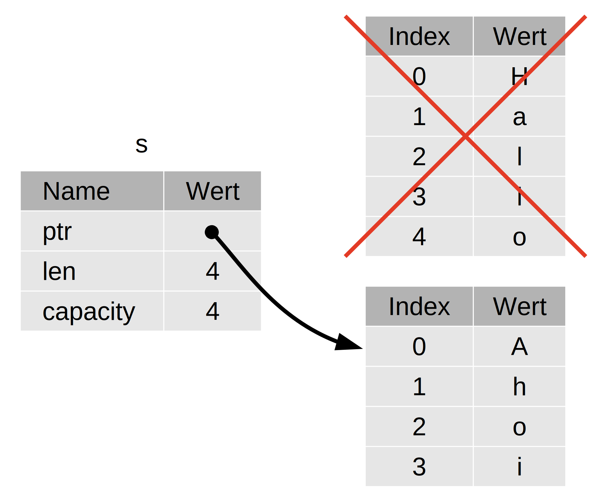

## Referenzen und Ausleihen (borrowing)

Das Problem mit dem Tupelcode in Codeblock 4-5 ist, dass wir der aufrufenden
Funktion den `String` zurückgeben müssen, damit wir den `String` nach dem
Aufruf von `calculate_length` weiter verwenden können, weil der `String` in
`calculate_length` verschoben wurde. Stattdessen können wir eine Referenz auf
den `String`-Wert angeben. Eine *Referenz* ist wie ein Zeiger, d.h. eine
Adresse, der wir folgen können, um auf Daten zugreifen zu können, die an dieser
Adresse gespeichert sind und einer anderen Variablen gehören. Im Gegensatz zu
einem Zeiger ist bei einer Referenz garantiert, dass sie auf einen gültigen
Wert eines bestimmten Typs zeigt.

Im Folgenden siehst du, wie du eine Funktion `calculate_length` definieren und
verwenden kannst, die eine Referenz auf ein Objekt als Parameter hat, anstatt
die Eigentümerschaft (ownership) des Wertes zu übernehmen:

<span class="filename">Dateiname: src/main.rs</span>

```rust
fn main() {
    let s1 = String::from("Hallo");

    let len = calculate_length(&s1);

    println!("Die Länge von '{}' ist {}.", s1, len);
}

fn calculate_length(s: &String) -> usize {
    s.len()
}
```

Beachte, dass der gesamte Tupelcode aus der Variablendeklaration und dem
Rückgabewert der Funktion verschwunden ist. Beachte des Weiteren, dass wir
`&s1` an `calculate_length` übergeben und in seiner Definition `&String` statt
`String` steht. Das `&`-Zeichen steht für eine *Referenz*, und sie ermöglicht
es dir, sich auf einen Wert zu beziehen, ohne dessen Eigentümerschaft zu
übernehmen. Abbildung 4-5 zeigt die Speicherdarstellung.



<span class="caption">Abbildung 4-5: Eine Grafik mit `&String s`, das auf
`String s1` zeigt</span>

> Anmerkung: Das Gegenteil der Referenzierung durch `&` ist die
> *Dereferenzierung* (dereferencing), die mittels Dereferenzoperator `*`
> erfolgt. Wir werden in Kapitel 8 einige Verwendungen des Dereferenzoperators
> sehen und in Kapitel 15 Einzelheiten der Dereferenzierung besprechen.

Schauen wir uns den Funktionsaufruf hier genauer an:

```rust
# fn main() {
    let s1 = String::from("Hallo");

    let len = calculate_length(&s1);
#
#     println!("Die Länge von '{}' ist {}.", s1, len);
# }
#
# fn calculate_length(s: &String) -> usize {
#     s.len()
# }
```

Die Syntax `&s1` erlaubt es uns, eine Referenz zu erstellen, die auf den Wert
von `s1` *referenziert*, ihn aber nicht besitzt. Da sie diesen nicht besitzt,
verfällt der Wert, auf den sie verweist, nicht, wenn die Referenz nicht mehr
benutzt wird.

Ebenso verwendet die Signatur der Funktion das Zeichen `&`, um anzuzeigen, dass
der Typ des Parameters `s` eine Referenz ist. Lass uns einige erklärende
Anmerkungen ergänzen:

```rust
# fn main() {
#     let s1 = String::from("Hallo");
#
#     let len = calculate_length(&s1);
#
#     println!("Die Länge von '{}' ist {}.", s1, len);
# }
#
fn calculate_length(s: &String) -> usize { // s ist eine Referenz
                                           // auf eine Zeichenkette
    s.len()
} // Hier verlässt s den Gültigkeitsbereich. Aber weil es keine
  // Eigentümerschaft an dem hat, worauf es referenziert, passiert nichts.
```

Der Gültigkeitsbereich, in dem die Variable `s` gültig ist, ist derselbe wie
der Gültigkeitsbereich eines Funktionsparameters, aber der Wert, auf den die
Referenz zeigt, wird nicht aufgeräumt, wenn `s` nicht mehr verwendet wird, weil
`s` keine Eigentümerschaft hat. Wenn Funktionen statt der tatsächlichen Werte
Referenzen als Parameter haben, brauchen wir die Werte nicht zurückzugeben, um
die Eigentümerschaft zurückzugeben, denn wir hatten nie die Eigentümerschaft.

Wir nennen den Vorgang des Erstellens einer Referenz *Ausleihen* (borrowing).
Wenn eine Person im richtigen Leben etwas besitzt, kannst du es von ihr
ausleihen. Wenn du fertig bist, musst du es zurückgeben. Es gehört dir nicht.

Was passiert nun, wenn wir versuchen, etwas zu verändern, das wir uns
ausleihen? Versuche den Code in Codeblock 4-6. Achtung: Es funktioniert nicht!

<span class="filename">Dateiname: src/main.rs</span>

```rust,does_not_compile
fn main() {
    let s = String::from("Hallo");

    change(&s);
}

fn change(some_string: &String) {
    some_string.push_str(" Welt");
}
```

<span class="caption">Codeblock 4-6: Versuch, einen ausgeliehenen Wert zu
verändern</span>

Hier ist die Fehlermeldung:

```console
$ cargo run
   Compiling ownership v0.1.0 (file:///projects/ownership)
error[E0596]: cannot borrow `*some_string` as mutable, as it is behind a `&` reference
 --> src/main.rs:8:5
  |
7 | fn change(some_string: &String) {
  |                        ------- help: consider changing this to be a mutable reference: `&mut String`
8 |     some_string.push_str(" Welt");
  |     ^^^^^^^^^^^ `some_string` is a `&` reference, so the data it refers to cannot be borrowed as mutable

For more information about this error, try `rustc --explain E0596`.
error: could not compile `ownership` due to previous error
```

So wie Variablen standardmäßig unveränderlich sind, so sind auch Referenzen
unveränderlich. Es ist uns nicht erlaubt, etwas zu verändern, auf das wir eine
Referenz haben.

### Veränderliche Referenzen

Wir können den Code aus Codeblock 4-6 so ändern, dass wir einen geliehenen Wert
mit ein paar kleinen Änderungen ändern können, die stattdessen eine
*veränderliche Referenz* verwenden:

<span class="filename">Dateiname: src/main.rs</span>

```rust
fn main() {
    let mut s = String::from("Hallo");

    change(&mut s);
}

fn change(some_string: &mut String) {
    some_string.push_str(" Welt");
}
```

Zuerst ändern wir `s`, um `mut` zu sein. Dann erstellen wir eine
veränderliche Referenz mit `&mut s`, wo wir die Funktion `change`
aufrufen, und aktualisieren die Funktionssignatur, um eine veränderliche
Referenz mit `some_string: &mut String` entgegenzunehmen. Dies macht deutlich,
dass die Funktion `change` den Wert, den sie ausleiht, verändert.

Veränderliche Referenzen haben eine große Einschränkung: Wenn du eine
veränderliche Referenz auf einen Wert hast, kannst du keine andere Referenz auf
diesen Wert haben. Dieser Code versucht, zwei veränderliche Referenzen auf `s`
zu erstellen, und wird fehlschlagen:

<span class="filename">Dateiname: src/main.rs</span>

```rust,does_not_compile
let mut s = String::from("Hallo");

let r1 = &mut s;
let r2 = &mut s;

println!("{}, {}", r1, r2);
```

Hier ist die Fehlermeldung:

```console
$ cargo run
   Compiling ownership v0.1.0 (file:///projects/ownership)
error[E0499]: cannot borrow `s` as mutable more than once at a time
 --> src/main.rs:5:14
  |
4 |     let r1 = &mut s;
  |              ------ first mutable borrow occurs here
5 |     let r2 = &mut s;
  |              ^^^^^^ second mutable borrow occurs here
6 | 
7 |     println!("{}, {}", r1, r2);
  |                        -- first borrow later used here

For more information about this error, try `rustc --explain E0499`.
error: could not compile `ownership` due to previous error
```

Dieser Fehler besagt, dass dieser Code ungültig ist, weil wir `s` nicht mehr
als einmal zur gleichen Zeit als veränderlich ausleihen können. Die erste
veränderliche Ausleihe ist in `r1` und muss beibehalten werden, bis sie in
`println!` verwendet wird, aber zwischen dem Erstellen dieser veränderlichen
Referenz und ihrer Verwendung haben wir versucht, eine andere veränderliche
Referenz in `r2` zu erstellen, der die gleichen Daten wie `r1` ausleiht.

Die Beschränkung, die mehrere veränderliche Referenz auf dieselben Daten zur
gleichen Zeit verhindert, erlaubt Veränderung, aber in einer sehr
kontrollierten Weise. Das ist etwas, womit Rust-Neulinge zu kämpfen haben, denn
in den meisten Sprachen kann man verändern wann immer man will. Diese
Beschränkung hat den Vorteil, dass Rust Daten-Wettlaufsituation zur
Kompilierzeit verhindern kann. Eine *Daten-Wettlaufsituation* (data race) ist
ähnlich einer Wettlaufsituation (race condition) und tritt auf, wenn diese drei
Verhaltensweisen auftreten:

* Zwei oder mehr Zeiger greifen gleichzeitig auf die gleichen Daten zu.
* Mindestens einer der Zeiger wird zum Schreiben auf die Daten verwendet.
* Es gibt keinen Mechanismus, um den Zugriff auf die Daten zu synchronisieren.

Daten-Wettlaufsituationen verursachen undefiniertes Verhalten und können
schwierig zu diagnostizieren und zu beheben sein, wenn du versuchst, sie zur
Laufzeit aufzuspüren; Rust verhindert dieses Problem, indem es Code mit
Daten-Wettlaufsituationen gar nicht erst kompiliert!

Wie immer können wir geschweifte Klammern verwenden, um einen neuen
Gültigkeitsbereich zu schaffen, der mehrere veränderliche Verweise erlaubt, nur
nicht *gleichzeitige*:

```rust
let mut s = String::from("Hallo");

{
    let r1 = &mut s;
} // r1 verlässt hier den Gültigkeitsbereich, sodass wir
  // problemlos eine neue Referenz erstellen können.

let r2 = &mut s;
```

Rust erzwingt eine ähnliche Regel für die Kombination von veränderlichen und
unveränderlichen Referenzen. Dieser Code führt zu einem Fehler:

```rust,does_not_compile
let mut s = String::from("Hallo");

let r1 = &s;     // kein Problem
let r2 = &s;     // kein Problem
let r3 = &mut s; // GROSSES PROBLEM

println!("{}, {} und {}", r1, r2, r3);
```

Hier ist die Fehlermeldung:

```console
$ cargo run
   Compiling ownership v0.1.0 (file:///projects/ownership)
error[E0502]: cannot borrow `s` as mutable because it is also borrowed as immutable
 --> src/main.rs:6:14
  |
4 |     let r1 = &s;     // kein Problem
  |              -- immutable borrow occurs here
5 |     let r2 = &s;     // kein Problem
6 |     let r3 = &mut s; // GROSSES PROBLEM
  |              ^^^^^^ mutable borrow occurs here
7 | 
8 |     println!("{}, {} und {}", r1, r2, r3);
  |                               -- immutable borrow later used here

For more information about this error, try `rustc --explain E0502`.
error: could not compile `ownership` due to previous error
```

Puh! Wir können auch keine veränderlichen Referenzen haben, solange wir eine
unveränderliche haben auf denselben Wert haben.

Nutzer einer unveränderlichen Referenz erwarten nicht, dass sich die Werte
dahinter plötzlich ändern! Mehrere unveränderliche Referenzen sind jedoch in
Ordnung, da niemand, der die Daten nur liest, die Möglichkeit hat, das Lesen
der Daten durch andere zu beeinflussen.

Beachte, dass der Gültigkeitsbereich einer Referenz dort beginnt, wo sie
eingeführt wird, und sich bis zur letzten Verwendung dieser Referenz fortsetzt. 
Zum Beispiel kompiliert dieser Code, weil die letzte Verwendung der
unveränderlichen Referenzen in `println!` vor der Einführung der veränderlichen
Referenz erfolgt:

```rust,edition2021
let mut s = String::from("Hallo");

let r1 = &s; // kein Problem
let r2 = &s; // kein Problem
println!("{} und {}", r1, r2);
// r1 und r2 werden nach dieser Stelle nicht mehr verwendet

let r3 = &mut s; // kein Problem
println!("{}", r3);
```

Die Gültigkeitsbereiche der unveränderlichen Referenzen `r1` und `r2` enden
nach dem `println!`, wo sie zuletzt verwendet werden, d.h. bevor die
veränderliche Referenz `r3` erstellt wird. Diese Gültigkeitsbereiche
überschneiden sich nicht, daher ist dieser Code zulässig: Der Compiler kann
erkennen, dass die Referenz bereits vor dem Ende des Gültigkeitsbereichs nicht
mehr verwendet wird.

Die Fähigkeit des
Compilers zu erkennen, dass eine Referenz an einem Punkt vor dem Ende des
Gültigkeitsbereichs nicht mehr verwendet wird, wird als *nicht-lexikalische
Lebensdauer* (Non-Lexical Lifetimes, kurz NLL) bezeichnet, und du kannst mehr
darüber in [The Edition Guide][nll] lesen.

Auch wenn Fehler durch Ausleihen manchmal frustrierend sein können, denke
daran, dass es der Rust-Compiler ist, der frühzeitig (zur Kompilierzeit und
nicht zur Laufzeit) auf einen möglichen Fehler hinweist und dir genau zeigt, wo
das Problem liegt. Dann musst du nicht aufspüren, warum deine Daten nicht so
sind, wie du dachtest.

### Hängende Referenzen

In Sprachen mit Zeigern ist es leicht, fälschlicherweise einen *hängenden
Zeiger* (dangling pointer) zu erzeugen, also einen Zeiger, der auf eine Stelle
im Speicher verweist, die vielleicht an jemand anderem vergeben wurde, weil der
Speicher freigegeben wurde, während noch ein Zeiger auf diesen Speicher
bestehen bleibt. In Rust hingegen garantiert der Compiler, dass Referenzen
niemals hängende Referenzen sein können: Wenn du eine Referenz auf Daten hast,
stellt der Compiler sicher, dass die Daten nicht den Gültigkeitsbereich
verlassen, bevor die Referenz auf die Daten dies tut.

Versuchen wir, eine hängende Referenz zu erstellen, um zu sehen wie Rust das
mit einem Kompilierfehler verhindert:

<span class="filename">Dateiname: src/main.rs</span>

```rust,does_not_compile
fn main() {
    let reference_to_nothing = dangle();
}

fn dangle() -> &String {
    let s = String::from("Hallo");

    &s
}
```

Hier ist die Fehlermeldung:

```console
$ cargo run
   Compiling ownership v0.1.0 (file:///projects/ownership)
error[E0106]: missing lifetime specifier
 --> src/main.rs:5:16
  |
5 | fn dangle() -> &String {
  |                ^ expected named lifetime parameter
  |
  = help: this function's return type contains a borrowed value, but there is no value for it to be borrowed from
help: consider using the `'static` lifetime
  |
5 | fn dangle() -> &'static String {
  |                ~~~~~~~~

For more information about this error, try `rustc --explain E0106`.
error: could not compile `ownership` due to previous error
```

Diese Fehlermeldung bezieht sich auf eine Funktionalität, die wir noch nicht
behandelt haben: Die Lebensdauer. Wir werden die Lebensdauer in Kapitel 10 im
Detail besprechen. Abgesehen von den Hinweisen zur Lebensdauer enthält die
Meldung den entscheidenden Hinweis, warum dieser Code nicht funktioniert:

```text
this function's return type contains a borrowed value, but there is no value
for it to be borrowed from
```

Lass uns einen genaueren Blick auf das werfen, was in jeder Phase unseres
`dangle`-Codes geschieht:

<span class="filename">Dateiname: src/main.rs</span>

```rust,does_not_compile
# fn main() {
#     let reference_to_nothing = dangle();
# }
#
fn dangle() -> &String { // dangle gibt eine Referenz
                         // auf eine Zeichenkette zurück

    let s = String::from("Hallo"); // s ist eine neue Zeichenkette

    &s // wir geben einen Verweis auf die Zeichenkette s zurück
} // Hier verlässt s den Gültigkeitsbereich und wird verworfen.
  // Sein Speicherplatz wird aufgeräumt. Gefahr!
```

Da `s` innerhalb `dangle` erzeugt wird, wird `s` wieder freigegeben, wenn der
Code von `dangle` zu Ende ist. Aber wir haben versucht, eine Referenz darauf
zurückzugeben. Das heißt, diese Referenz würde auf einen ungültigen `String`
verweisen. Das ist nicht gut! Rust lässt uns das nicht tun.

Die Lösung ist, den `String` direkt zurückzugeben:

```rust
# fn main() {
#     let string = no_dangle();
# }
#
fn no_dangle() -> String {
    let s = String::from("Hallo");

    s
}
```

Dies funktioniert ohne Probleme. Die Eigentümerschaft wird nach außen
verschoben, und nichts wird freigegeben.

### Regeln für Referenzen

Lass uns rekapitulieren, was wir über Referenzen gelernt haben:

* Zu jedem beliebigen Zeitpunkt kannst du *entweder* eine veränderliche
  Referenz *oder* eine beliebige Anzahl unveränderlicher Referenzen haben.
* Referenzen müssen immer gültig sein.

Als Nächstes werden wir uns mit einer anderen Art von Referenz befassen:
Anteilstypen (slice).
