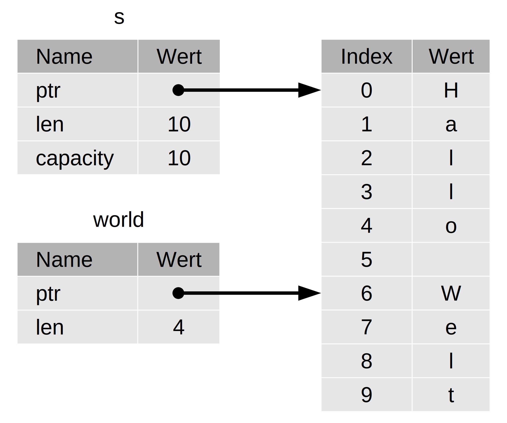

## Der Anteilstyp (slice)

Mit *Anteilstypen* kannst du auf eine zusammenhängende Folge von Elementen in
einer [Kollektion][collection] referenzieren anstatt auf die gesamte
Kollektion. Ein Anteilstyp ist eine Art Referenz und hat daher keine
Eigentümerschaft.

Hier ist ein kleines Programmierproblem: Schreibe eine Funktion, die eine
Zeichenkette mit durch Leerzeichen getrennten Wörtern entgegennimmt und das
erste Wort zurückgibt, das sie in dieser Zeichenkette findet. Wenn die Funktion
kein Leerzeichen in der Zeichenkette findet, muss die gesamte Zeichenkette ein
Wort sein, also sollte die gesamte Zeichenkette zurückgegeben werden.

Gehen wir einmal durch, wie wir die Signatur dieser Funktion ohne Verwendung
von Anteilstypen schreiben würden, um das Problem zu verstehen, das durch
Anteilstypen gelöst wird:

```rust,ignore
fn first_word(s: &String) -> ?
```

Die Funktion `first_word` hat einen `&String` als Parameter. Wir wollen keine
Eigentümerschaft, also ist das in Ordnung. Aber was sollen wir zurückgeben? Wir
haben nicht wirklich eine Möglichkeit, über *einen Teil* einer Zeichenkette zu
sprechen. Wir könnten jedoch den Index des Wortendes zurückgeben. Versuchen wir
das, wie in Codeblock 4-7 gezeigt.

<span class="filename">Dateiname: src/main.rs</span>

```rust
fn first_word(s: &String) -> usize {
    let bytes = s.as_bytes();

    for (i, &item) in bytes.iter().enumerate() {
        if item == b' ' {
            return i;
        }
    }

    s.len()
}
#
# fn main() {}
```

<span class="caption">Codeblock 4-7: Die Funktion `first_word`, die einen
Byte-Indexwert zum Parameter `String` zurückgibt</span>

Da wir den `String` Zeichen für Zeichen durchgehen und prüfen müssen, ob ein
Wert ein Leerzeichen ist, wandeln wir unseren `String` mit der Methode
`as_bytes` in ein Byte-Array um.

```rust
# fn first_word(s: &String) -> usize {
    let bytes = s.as_bytes();
#
#     for (i, &item) in bytes.iter().enumerate() {
#         if item == b' ' {
#             return i;
#         }
#     }
#
#     s.len()
# }
#
# fn main() {}
```

Als nächstes erstellen wir einen Iterator über das Byte-Array, indem wir die
Methode `iter` verwenden:

```rust
# fn first_word(s: &String) -> usize {
#     let bytes = s.as_bytes();
#
    for (i, &item) in bytes.iter().enumerate() {
#         if item == b' ' {
#             return i;
#         }
#     }
#
#     s.len()
# }
#
# fn main() {}
```

Auf Iteratoren werden wir in [Kapitel 13][ch13-2] näher eingehen. Fürs Erste
solltest du wissen, dass `iter` eine Methode ist, die jedes Element in einer
Kollektion zurückgibt und dass `enumerate` das Ergebnis von `iter` umhüllt und
stattdessen jedes Element als Teil eines Tupels zurückgibt. Das erste Element
des Tupels, das von `enumerate` zurückgegeben wird, ist der Index, und das
zweite Element ist eine Referenz auf das Element. Das ist etwas bequemer, als
den Index selbst zu berechnen.

Da die Methode `enumerate` ein Tupel zurückgibt, können wir Muster verwenden,
um dieses Tupel zu zerlegen. Wir werden uns in [Kapitel 6][ch6] eingehender mit
Mustern befassen. In der `for`-Schleife spezifizieren wir also ein Muster, das
`i` für den Index im Tupel und `&item` für das einzelne Byte im Tupel hat. Da
wir eine Referenz auf das Element aus `.iter().enumerate()` erhalten, verwenden
wir `&` im Muster.

Innerhalb der `for`-Schleife suchen wir mit Hilfe der Byte-Literal-Syntax
`b' '` nach dem Byte, das das Leerzeichen repräsentiert. Wenn wir ein
Leerzeichen finden, geben wir die Position zurück. Andernfalls geben wir die
Länge der Zeichenkette zurück, indem wir `s.len()` verwenden.

```rust
# fn first_word(s: &String) -> usize {
#     let bytes = s.as_bytes();
#
#     for (i, &item) in bytes.iter().enumerate() {
        if item == b' ' {
            return i;
        }
    }

    s.len()
# }
#
# fn main() {}
```

Wir haben jetzt eine Möglichkeit, den Index des ersten Wortendes in der
Zeichenkette herauszufinden, aber es gibt ein Problem. Wir geben ein `usize`
für sich allein zurück, aber die Zahl ist nur aussagekräftig im Kontext des
`&String`. Mit anderen Worten: Da es sich um einen vom `String` getrennten Wert
handelt, gibt es keine Garantie, dass er auch in Zukunft noch gültig ist.
Betrachte das Programm in Codeblock 4-8, das die Funktion `first_word` aus
Codeblock 4-7 verwendet.

<span class="filename">Dateiname: src/main.rs</span>

```rust
# fn first_word(s: &String) -> usize {
#     let bytes = s.as_bytes();
#
#     for (i, &item) in bytes.iter().enumerate() {
#         if item == b' ' {
#             return i;
#         }
#     }
#
#     s.len()
# }
#
fn main() {
    let mut s = String::from("Hallo Welt");

    let word = first_word(&s); // word erhält den Wert 5

    s.clear(); // leert die Zeichenkette und macht sie gleich ""

    // word hat noch immer den Wert 5, aber es gibt keine Zeichenkette mehr,
    // mit der wir den Wert 5 sinnvoll verwenden könnten.
    // word ist jetzt völlig ungültig!
}
```

<span class="caption">Codeblock 4-8: Speichern des Ergebnisses des
Funktionsaufrufs `first_word` und anschließendes Ändern des Inhalts der
Zeichenkette</span>

Dieses Programm kompiliert fehlerfrei und würde dies auch tun, wenn wir `word`
nach dem Aufruf von `s.clear()` benutzen würden. Da `word` überhaupt nicht mit
dem Zustand von `s` verbunden ist, enthält `word` immer noch den Wert `5`. Wir
könnten den Wert `5` mit der Variable `s` verwenden, um zu versuchen, das erste
Wort zu extrahieren, aber das wäre ein Fehler, weil sich der Inhalt von `s`
geändert hat, nachdem wir `5` in `word` gespeichert haben.

Sich darum kümmern zu müssen, dass der Index in `word` mit den Daten in `s`
konform ist, ist mühsam und fehleranfällig! Das Verwalten dieser Indizes ist
noch fehleranfälliger, wenn wir eine Funktion `second_word` schreiben. Ihre
Signatur müsste dann so aussehen:

```rust,ignore
fn second_word(s: &String) -> (usize, usize) {
```

Jetzt verfolgen wir einen Anfangs- *und* einen Endindex, und wir haben noch
mehr Werte, die aus Daten in einem bestimmten Zustand berechnet wurden, aber
überhaupt nicht an diesen Zustand gebunden sind. Wir haben drei unverbundene
Variablen, die synchron gehalten werden müssen.

Glücklicherweise hat Rust eine Lösung für dieses Problem:
Zeichenkettenanteilstypen

### Zeichenkettenanteilstypen (string slices)

Ein *Zeichenkettenanteilstyp*  (string slice) ist ein Verweis auf einen Teil
eines `String`, und er sieht so aus:

```rust
let s = String::from("Hallo Welt");

let hello = &s[0..5];
let world = &s[6..10];
```

Anstelle einer Referenz auf den gesamten `String` ist `hello` eine Referenz auf
einen Teil des `String`, der mit dem zusätzlichen `[0..5]` spezifiziert ist.
Wir erstellen Anteilstypen unter Angabe eines Bereichs innerhalb von Klammern,
indem wir `[starting_index..ending_index]` angeben, wobei `starting_index` die
erste Position im Anteilstyp und `ending_index` eine Position mehr als die
letzte Position im Anteilstyp ist. Intern speichert die
Anteilstyp-Datenstruktur die Anfangsposition und die Länge des Anteilstypen,
was `ending_index` minus `starting_index` entspricht. Im Fall von `let world =
&s[6..10];` wäre `world` also ein Anteilstyp, der einen Zeiger auf das Byte bei
Index 6 von `s` mit dem Längenwert `4` enthält.

Abbildung 4-7 stellt dies dar.



<span class="caption">Abbildung 4-7: Zeichenkettenanteilstyp, der sich auf einen
Teil eines `String` bezieht</span>

Wenn du mit der Bereichssyntax `..` in Rust beim Index 0 beginnen willst,
kannst du den Wert vor den zwei Punkte weglassen. Mit anderen Worten sind diese
gleich:

```rust
let s = String::from("Hallo");

let slice = &s[0..2];
let slice = &s[..2];
```

Ebenso kannst du den Endindex weglassen, wenn dein Anteilstyp das letzte Byte
des `String` enthält. Das bedeutet, dass diese gleich sind:

```rust
let s = String::from("Hallo");

let len = s.len();

let slice = &s[3..len];
let slice = &s[3..];
```

Du kannst auch beide Werte weglassen, um einen Ausschnitt der gesamten
Zeichenkette zu beschreiben. Diese sind also gleichwertig:

```rust
let s = String::from("Hallo");

let len = s.len();

let slice = &s[0..len];
let slice = &s[..];
```

> Hinweis: Bereichsindizes bei Zeichenkettenanteilstypen müssen sich nach
> gültigen UTF-8-Zeichengrenzen richten. Wenn du versuchst, einen
> Zeichenkettenanteilstyp in der Mitte eines Mehrbyte-Zeichens zu erstellen,
> wird dein Programm mit einem Fehler abbrechen. Bei der Einführung von
> Zeichenkettenanteilstypen in diesem Abschnitt gehen wir nur von ASCII aus;
> eine eingehendere Diskussion der UTF-8-Behandlung findet sich im Abschnitt
> [„UTF-8-kodierten Text in Zeichenketten (strings) ablegen“][strings] in
> Kapitel 8.

Mit all diesen Informationen im Hinterkopf schreiben wir `first_word` so um,
dass es einen Anteilstyp zurückgibt. Der Typ mit der Bedeutung
„Zeichenkettenanteilstyp“ wird `&str` geschrieben:

<span class="filename">Dateiname: src/main.rs</span>

```rust
fn first_word(s: &String) -> &str {
    let bytes = s.as_bytes();

    for (i, &item) in bytes.iter().enumerate() {
        if item == b' ' {
            return &s[0..i];
        }
    }

    &s[..]
}
#
# fn main() {}
```

Den Index für das Wortende erhalten wir auf die gleiche Weise wie in Codeblock
4-7, indem wir nach dem ersten Vorkommen eines Leerzeichens suchen. Wenn wir
ein Leerzeichen finden, geben wir einen Zeichenkettenanteilstyp zurück, wobei
wir den Anfang der Zeichenkette und den Index des Leerzeichens als Anfangs-
bzw. Endindex verwenden.

Wenn wir nun `first_word` aufrufen, erhalten wir einen einzelnen Wert zurück,
der an die zugrundeliegenden Daten gebunden ist. Der Wert setzt sich aus einer
Referenz auf den Startpunkt des Anteilstyps und der Anzahl der Elemente im
Anteilstyp zusammen.

Die Rückgabe eines Anteilstyps würde auch für eine Funktion `second_word`
funktionieren:

```rust,ignore
fn second_word(s: &String) -> &str {
```

Wir haben jetzt eine einfache API, die viel schwieriger durcheinanderzubringen
ist, weil der Compiler sicherstellt, dass die Referenzen auf den `String`
gültig bleiben. Erinnere dich an den Fehler im Programm in Codeblock 4-8, als
wir den Index bis zum Ende des ersten Wortes erhielten, dann aber die
Zeichenkette löschten, sodass unser Index ungültig wurde. Dieser Code war
logisch falsch, zeigte aber keine unmittelbaren Fehler. Die Probleme würden
sich später zeigen, wenn wir weiterhin versuchen würden, den ersten Wortindex
mit einer leeren Zeichenkette zu verwenden. Anteilstypen machen diesen Fehler
unmöglich und lassen uns viel früher wissen, dass wir ein Problem mit unserem
Code haben. Die Anteilstypen-Variante von `first_word` führt zu einem
Kompilierfehler:

<span class="filename">Dateiname: src/main.rs</span>

```rust,does_not_compile
# fn first_word(s: &String) -> &str {
#     let bytes = s.as_bytes();
#
#     for (i, &item) in bytes.iter().enumerate() {
#         if item == b' ' {
#             return &s[0..i];
#         }
#     }
#
#     &s[..]
# }
#
fn main() {
    let mut s = String::from("Hallo Welt");

    let word = first_word(&s);

    s.clear(); // Fehler!

    println!("Das erste Wort ist: {word}");
}
```

Hier ist der Kompilierfehler:

```console
$ cargo run
   Compiling ownership v0.1.0 (file:///projects/ownership)
error[E0502]: cannot borrow `s` as mutable because it is also borrowed as immutable
  --> src/main.rs:18:5
   |
16 |     let word = first_word(&s);
   |                           -- immutable borrow occurs here
17 | 
18 |     s.clear(); // Fehler!
   |     ^^^^^^^^^ mutable borrow occurs here
19 | 
20 |     println!("Das erste Wort ist: {word}");
   |                                   ------ immutable borrow later used here

For more information about this error, try `rustc --explain E0502`.
error: could not compile `ownership` (bin "ownership") due to 1 previous error
```

Erinnere dich an die Ausleihregeln, durch die wir, wenn wir eine
unveränderbare Referenz auf etwas haben, nicht noch eine veränderbare
Referenz anlegen können. Da `clear` den `String` abschneiden muss, muss es
eine veränderbare Referenz erhalten. Das `println!` nach dem Aufruf von
`clear` verwendet die Referenz in `word`, sodass die unveränderbare Referenz
zu diesem Zeitpunkt noch aktiv sein muss. Rust verbietet, dass die
veränderbare Referenz in `clear` und die unveränderbare Referenz in `word`
nicht gleichzeitig existieren, und die Kompilierung schlägt fehl. Rust hat
nicht nur die Benutzung unserer API vereinfacht, sondern auch eine ganze Klasse
von Fehlern zur Kompilierzeit beseitigt!

#### Zeichenkettenliterale als Anteilstypen

Erinnere dich, dass wir darüber sprachen, dass Zeichenkettenliterale in der
Binärdatei gespeichert werden. Jetzt, da wir über Anteilstypen Bescheid wissen,
können wir Zeichenkettenliterale richtig verstehen:

```rust
let s = "Hallo Welt!";
```

Der Typ von `s` hier ist `&str`: Es ist ein Anteilstyp, der auf diesen
speziellen Punkt der Binärdatei zeigt. Das ist auch der Grund, warum
Zeichenkettenliterale unveränderbar sind; `&str` ist eine unveränderbare
Referenz.

#### Zeichenkettenanteilstypen als Parameter

Das Wissen, dass man Anteilstypen von Literalen und `String`-Werten erstellen
kann, führt uns zu einer weiteren Verbesserung von `first_word`, und das ist
ihre Signatur:

```rust,ignore
fn first_word(s: &String) -> &str {
```

Ein erfahrenerer Rust-Entwickler würde stattdessen die in Codeblock 4-9
gezeigte Signatur schreiben, da sie es uns erlaubt, dieselbe Funktion sowohl
auf `&String`-Werte als auch auf `&str`-Werte anzuwenden.

```rust
fn first_word(s: &str) -> &str {
#     let bytes = s.as_bytes();
#
#     for (i, &item) in bytes.iter().enumerate() {
#         if item == b' ' {
#             return &s[0..i];
#         }
#     }
#
#     &s[..]
# }
#
# fn main() {
#     let my_string = String::from("Hallo Welt");
#
#     // `first_word` funktioniert mit Anteilstypen von `String`, ob teilweise oder ganz
#     let word = first_word(&my_string[0..6]);
#     let word = first_word(&my_string[..]);
#     // `first_word` funktioniert auch bei Referenzen auf `String`, die
#     // äquivalent zu ganzen Anteilstypen von `String` sind
#     let word = first_word(&my_string);
#
#     let my_string_literal = "Hallo Welt";
#
#     // `first_word` funktioniert mit Anteilstypen von Zeichenkettenliteralen, ob teilweise oder ganz
#     let word = first_word(&my_string_literal[0..6]);
#     let word = first_word(&my_string_literal[..]);
#
#     // Da Zeichenkettenliterale bereits Zeichenkettenanteilstypen sind,
#     // funktioniert dies auch ohne die Anteilstypensyntax!
#     let word = first_word(my_string_literal);
# }
```

<span class="caption">Codeblock 4-9: Verbessern der Funktion `first_word` durch
Verwenden eines Zeichenkettenanteilstyps für den Typ des Parameters `s`</span>

Wenn wir einen Zeichenkettenanteilstyp haben, können wir diesen direkt
übergeben. Wenn wir einen `String` haben, können wir einen Anteilstyp des
`String` oder eine Referenz auf den `String` übergeben. Diese Flexibilität
nutzt die Vorteile der *automatischen Umwandlung*, eine Funktionalität, die wir
im Abschnitt [„Implizite automatische Umwandlung mit Funktionen und
Methoden“][deref-coercions] in Kapitel 15 behandeln.

Das Definieren einer Funktion, die einen Zeichenkettenanteilstyp statt einer
Referenz auf einen `String` entgegennimmt, macht unsere API allgemeiner und
nützlicher, ohne an Funktionalität einzubüßen:

<span class="filename">Dateiname: src/main.rs</span>

```rust
# fn first_word(s: &str) -> &str {
#     let bytes = s.as_bytes();
#
#     for (i, &item) in bytes.iter().enumerate() {
#         if item == b' ' {
#             return &s[0..i];
#         }
#     }
#
#     &s[..]
# }
#
fn main() {
    let my_string = String::from("Hallo Welt");

    // `first_word` funktioniert mit Anteilstypen von `String`, ob teilweise oder ganz
    let word = first_word(&my_string[0..6]);
    let word = first_word(&my_string[..]);
    // `first_word` funktioniert auch bei Referenzen auf `String`, die
    // äquivalent zu ganzen Anteilstypen von `String` sind
    let word = first_word(&my_string);

    let my_string_literal = "Hallo Welt";

    // `first_word` funktioniert mit Anteilstypen von Zeichenkettenliteralen, ob teilweise oder ganz
    let word = first_word(&my_string_literal[0..6]);
    let word = first_word(&my_string_literal[..]);

    // Da Zeichenkettenliterale bereits Zeichenkettenanteilstypen sind,
    // funktioniert dies auch ohne die Anteilstypensyntax!
    let word = first_word(my_string_literal);
}
```

### Andere Anteilstypen

Zeichenkettenanteilstypen sind, wie du dir vorstellen kannst, spezifisch für
Zeichenketten. Es gibt aber auch einen allgemeineren Anteilstyp. Betrachte
dieses Array:

```rust
let a = [1, 2, 3, 4, 5];
```

Genauso wie wir vielleicht auf einen Teil einer Zeichenkette verweisen möchten,
möchten wir vielleicht auf einen Teil eines Arrays verweisen. Wir würden das so
machen:

```rust
let a = [1, 2, 3, 4, 5];

let slice = &a[1..3];

assert_eq!(slice, &[2, 3]);
```

Dieser Anteilstyp hat den Typ `&[i32]`. Es funktioniert auf die gleiche Weise
wie bei Zeichenkettenanteilstypen, indem es eine Referenz auf das erste Element
und eine Länge speichert. Du wirst diese Art von Anteilstyp für alle möglichen
anderen Kollektionen verwenden. Wir werden diese Kollektionen im Detail
besprechen, wenn wir in Kapitel 8 über Vektoren sprechen.

## Zusammenfassung

Die Konzepte von Eigentümerschaft, Ausleihen und Anteilstypen gewährleisten
Speichersicherheit zur Kompilierzeit in Rust-Programmen. Die Sprache Rust gibt
dir Kontrolle über die Speicherverwendung auf die gleiche Weise wie andere
Systemprogrammiersprachen, aber dadurch, dass der Eigentümer der Daten diese
automatisch aufräumt, wenn der Eigentümer den Gültigkeitsbereich verlässt,
bedeutet dies, dass du keinen zusätzlichen Code schreiben und debuggen musst,
um diese Kontrolle zu erhalten.

Die Eigentümerschaft wirkt sich auf die Funktionsweise vieler anderer Teile von
Rust aus, deshalb werden wir im weiteren Verlauf des Buchs weiter über diese
Konzepte sprechen. Lass uns zu Kapitel 5 übergehen und uns das Gruppieren von
Datenteilen zu einer `struct` ansehen.

[ch13-2]: ch13-02-iterators.html
[ch6]: ch06-02-match.html#muster-die-werte-binden
[collection]: ch08-00-common-collections.md
[deref-coercions]: ch15-02-deref.html#implizite-automatische-umwandlung-mit-funktionen-und-methoden
[strings]: ch08-02-strings.html
