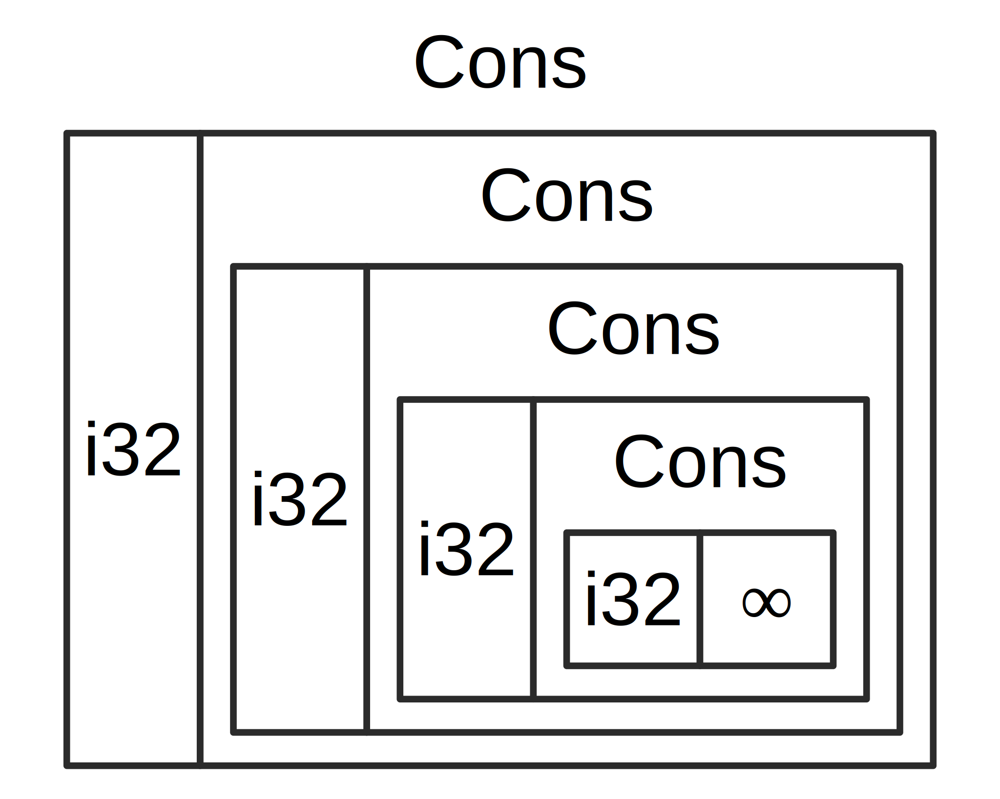
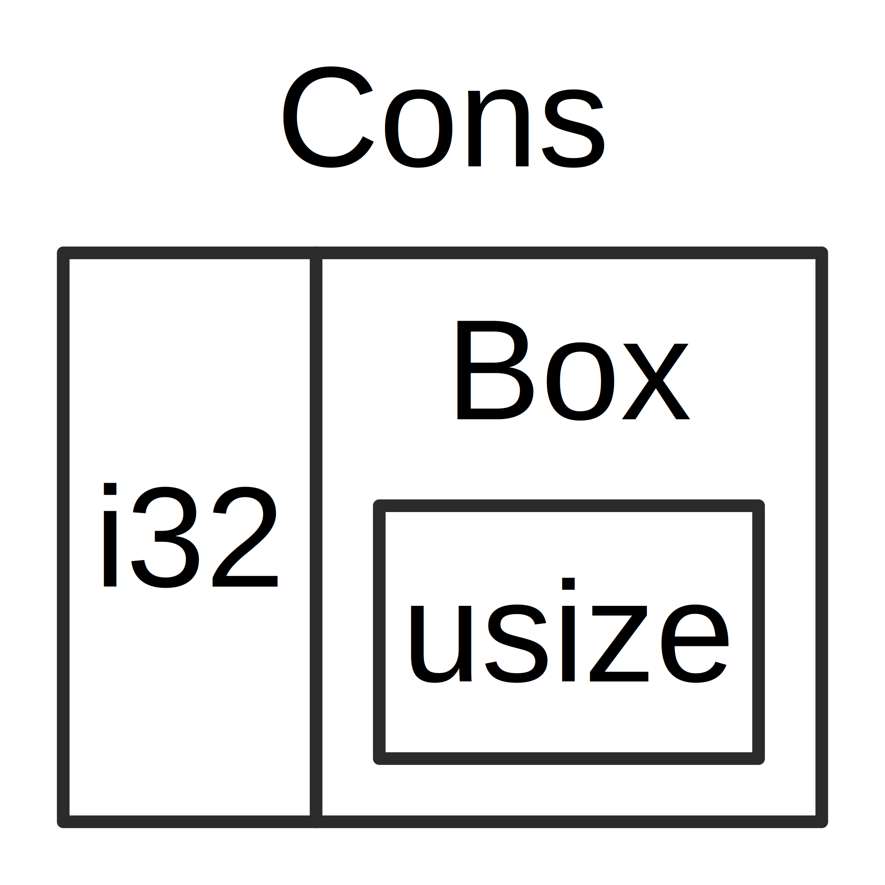

## Mit `Box<T>` auf Daten im Haldenspeicher (heap) zeigen

Der einfachste intelligente Zeiger ist *Box*, deren Typ `Box<T>` lautet. In
Boxen kann man Daten statt auf dem Stapelspeicher im Haldenspeicher
speichern. Was auf dem Stapelspeicher verbleibt, ist der Zeiger auf die Daten im
Haldenspeicher. In Kapitel 4 findest du Informationen zum Unterschied
zwischen dem Stapelspeicher und dem Haldenspeicher.

Boxen haben keinen Performanz-Overhead, außer dass die Daten auf
den Haldenspeicher anstatt auf dem Stapelspeicher gespeichert werden, aber
sie haben auch nicht viele zusätzliche Funktionalitäten. Sie werden am
häufigsten in folgenden Situationen verwendet:

* Wenn man einen Typ hat, dessen Größe zum Zeitpunkt der Kompilierung nicht
    bekannt ist, und man einen Wert dieses Typs in einem Kontext verwenden
    möchte, für den eine genaue Größe erforderlich ist.
* Wenn man über eine große Datenmenge verfügt und die Eigentümerschaft
    (ownership) übertragen möchte und sicherstellen will, dass die Daten dabei
    nicht kopiert werden.
* Wenn man einen Wert besitzen möchte und sich nur darum kümmert, dass es sich
    um einen Typ handelt, der ein bestimmtes Merkmal implementiert, anstatt den
    Typ zu spezifizieren.

Wir werden die erste Situation im Abschnitt [„Ermöglichen rekursiver Typen mit
Boxen“](#ermöglichen-rekursiver-typen-mit-boxen) zeigen. Im zweiten Fall kann
die Übertragung der Eigentümerschaft einer großen Datenmenge lange dauern, da
die Daten auf dem Stapelspeicher kopiert werden. Um die Performanz in dieser
Situation zu verbessern, können wir die große Datenmenge auf dem Haldenspeicher
in einer Box speichern. Dann wird nur die kleine Menge von Zeigerdaten auf dem
Stapelspeicher kopiert, während die Daten, auf die verwiesen wird, im
Haldenspeicher an einer Stelle verbleiben. Der dritte Fall ist als
*Merkmalsobjekt* (trait object) bekannt, und Kapitel 17 widmet einen ganzen
Abschnitt [„Merkmalsobjekte (trait objects) die Werte unterschiedlicher Typen
erlauben“][trait-objects] diesem Thema. Was du hier lernst, wirst du im Kapitel
17 erneut anwenden!

### `Box<T>` verwenden um Daten im Haldenspeicher zu speichern

Bevor wir den Haldenspeicher-Anwendungsfall für `Box<T>` besprechen, werden wir
die Syntax und die Interaktion mit Werten behandeln, die in einer `Box<T>`
gespeichert sind.

Codeblock 15.1 zeigt, wie man mit einer Box einen `i32`-Wert auf dem
Haldenspeicher speichert:

<span class="filename">Dateiname: src/main.rs</span>

```rust
fn main() {
    let b = Box::new(5);
    println!("b = {}", b);
}
```

<span class="caption">Codeblock 15-1: Speichern eines `i32`-Wertes in einer Box
im Haldenspeicher</span>

Wir definieren die Variable `b` so, dass sie den den Wert einer `Box` hat die
auf den Wert `5` zeigt, der auf dem Haldenspeicher alloziert ist.
Dieses Programm gibt `b = 5` aus, in diesem Fall können wir auf die Daten in der
Box zugreifen, ähnlich als würden sich die Daten im Stapelspeicher befinden.
Genau wie bei Werten mit Eigentümerschaft wird auch eine Box freigegeben
wenn sie den Gültigkeitsbereich verlässt, wie dies bei `b` am Ende von `main`
der Fall ist. Die Freigabe erfolgt sowohl für die Box (gespeichert im
Stapelspeicher) als auch für die Daten, auf die sie zeigt (gespeichert im
Haldenspeicher).

Es ist nicht sehr nützlich, einen einzelnen Wert im Haldenspeicher zu
speichern, daher verwendet man Boxen selten alleine. Meistens ist es besser,
Werte wie eine `i32` auf dem Stapelspeicher zu haben, wo sie standardmäßig
gespeichert werden. Sehen wir uns einen Fall an, in dem Boxen es uns
ermöglichen, Typen zu definieren, die wir nicht hätten, wenn es keine Boxen
gäbe.

### Ermöglichen rekursiver Typen mit Boxen

Ein Wert eines *rekursiven Typs* kann einen anderen Wert desselben Typs als
Teil von sich selbst haben. Rekursive Typen stellen ein Problem dar, weil Rust
zur Kompilierzeit wissen muss, wie viel Platz ein Typ einnimmt. Allerdings
könnte die Verschachtelung von Werten rekursiver Typen theoretisch unendlich
weitergehen, sodass Rust nicht wissen kann, wie viel Platz der Wert benötigt.
Da Boxen eine bekannte Größe haben, können wir rekursive Typen ermöglichen,
indem wir eine Box in die Definition des rekursiven Typs einfügen.

Als Beispiel für einen rekursiven Typ wollen wir uns die *Cons-Liste* ansehen.
Dies ist ein Datentyp, den man häufig in funktionalen Programmiersprachen
findet. Der Cons-Listen-Typ, den wir definieren werden, ist bis auf die
Rekursion einfach; daher werden die Konzepte in dem Beispiel, mit dem wir
arbeiten werden, immer dann nützlich sein, wenn du in komplexeren Situationen
mit rekursiven Typen arbeitest.

#### Weitere Informationen zur Cons-Liste

Eine *Cons-Liste* ist eine Datenstruktur, die aus der Programmiersprache Lisp
und ihren Dialekten stammt und aus verschachtelten Paaren besteht. Sie ist die
Lisp-Version einer verketteten Liste. Ihr Name stammt von der Funktion `cons`
(Kurzform von „construct function“) in Lisp, die aus ihren beiden Argumenten
ein neues Paar konstruiert. Durch den Aufruf von `cons` für ein Paar, das aus
einem Wert und einem anderen Paar besteht, können wir Cons-Listen konstruieren,
die aus rekursiven Paaren bestehen.

Hier ist zum Beispiel eine Pseudocode-Darstellung einer Cons-Liste, die die
Liste 1, 2, 3 enthält, wobei jedes Paar in Klammern steht:

```text
(1, (2, (3, Nil)))
```

Jedes Element in einer Cons-Liste enthält zwei Elemente: Den Wert des aktuellen
Elements und das nächste Element. Das letzte Element in der Liste enthält nur
ein Element namens `Nil` ohne ein nächstes Element. Eine Cons-Liste wird durch
rekursives Aufrufen der Funktion `cons` erstellt. Der kanonische Name für den
Basisfall der Rekursion lautet `Nil`. Beachte, dass dies nicht mit dem Konzept
„null“ oder „nil“ in Kapitel 6 identisch ist, das einen fehlenden oder
ungültigen Wert darstellt.

Die Cons-Liste verwenden ist keine häufig verwendete Datenstruktur in Rust. Wenn
man in Rust eine Liste von Elementen hat, ist `Vec<T>` die bessere Wahl.
Andere, komplexere rekursive Datentypen sind in verschiedenen Situationen
nützlich. Wenn wir jedoch mit der Cons-Liste beginnen, können wir untersuchen,
wie Boxen es uns ermöglichen, ohne grosse Ablenkung einen rekursiven Datentyp
zu definieren.

Codeblock 15-2 enthält eine Aufzählungsdefinition (enum) für eine Cons-Liste. Beachte,
dass dieser Code nicht kompiliert werden kann, da der Typ `List` keine bekannte
Grösse hat, was wir zeigen werden.

<span class="filename">Dateiname: src/main.rs</span>

```rust,does_not_compile
enum List {
    Cons(i32, List),
    Nil,
}
```

<span class="caption">Codeblock 15-2: Der erste Versuch eine Aufzählung zu
definieren, um eine Datenstruktur der Cons-Liste von `i32`-Werten darzustellen</span>

> Hinweis: Für dieses Beispiel implementieren wir eine Cons-Liste, die nur
> `i32`-Werte enthält. Wir hätten sie mit generischen Typen implementieren
> können wie wir es in Kapitel 10 besprochen haben, um eine Cons-Liste zu
> erstellen, in der Werte eines beliebigen Typs gespeichert werden können.

Verwendung des Typs `List` um die Liste `1, 2, 3` zu speichern.
Siehe Codeblock 15-3:

<span class="filename">Dateiname: src/main.rs</span>

```rust,does_not_compile
#enum List {
#    Cons(i32, List),
#    Nil,
#}
#
use crate::List::{Cons, Nil};

fn main() {
    let list = Cons(1, Cons(2, Cons(3, Nil)));
}
```

<span class="caption">Codeblock 15-3: Verwendung der `List`-Aufzählung um die 
Liste `1, 2, 3` zu speichern</span>

Der erste `Cons`-Wert enthält `1` und einen anderen `List`-Wert. Dieser
`List`-Wert ist ein weiterer `Cons`-Wert, der `2` und einen anderen `List`-Wert
enthält. Dieser `List`-Wert ist ein weiterer `Cons`, der `3` enthält und ein
`List`, der schliesslich `Nil` ist, die nicht rekursive Variante, die das Ende
der Liste signalisiert.


Wenn wir versuchen den Programmcode in Codeblock 15-3 zu kompilieren,
erhalten wir den Fehler der in Codeblock 15-4 gezeigt wird:

```console
$ cargo run
   Compiling cons-list v0.1.0 (file:///projects/cons-list)
error[E0072]: recursive type `List` has infinite size
 --> src/main.rs:1:1
  |
1 | enum List {
  | ^^^^^^^^^ recursive type has infinite size
2 |     Cons(i32, List),
  |               ---- recursive without indirection
  |
help: insert some indirection (e.g., a `Box`, `Rc`, or `&`) to make `List` representable
  |
2 |     Cons(i32, Box<List>),
  |               ++++    +

error[E0391]: cycle detected when computing drop-check constraints for `List`
 --> src/main.rs:1:1
  |
1 | enum List {
  | ^^^^^^^^^
  |
  = note: ...which again requires computing drop-check constraints for `List`, completing the cycle
  = note: cycle used when computing dropck types for `Canonical { max_universe: U0, variables: [], value: ParamEnvAnd { param_env: ParamEnv { caller_bounds: [], reveal: UserFacing }, value: List } }`

Some errors have detailed explanations: E0072, E0391.
For more information about an error, try `rustc --explain E0072`.
error: could not compile `cons-list` due to 2 previous errors
```

<span class="caption">Codeblock 15-4: Der Fehler den wir erhalten wenn wir
versuchen eine rekursive Aufzählung zu definieren</span>

Der Fehler zeigt, dass dieser Typ „unendlich groß“ ist. Der Grund dafür ist,
dass wir `List` mit einer rekursiven Variante definiert haben, sie enthält
direkt einen anderen Wert von sich selbst, daher kann Rust nicht herausfinden,
wie viel Speicherplatz zum Speichern eines Listenwerts erforderlich ist. Lass
uns zusammenfassen, warum wir diesen Fehler bekommen. Schauen wir uns zunächst
an, wie Rust entscheidet, wie viel Speicherplatz zum Speichern des Werts eines
nicht rekursiven Typs benötigt wird.

#### Die Größe eines nicht-rekursiven Typs berechnen

Erinnere dich an die in Codeblock 6-2 definierte `Message`-Aufzählung, als wir
die Definition von Aufzählungen in Kapitel 6 besprochen haben:

```rust
enum Message {
    Quit,
    Move { x: i32, y: i32 },
    Write(String),
    ChangeColor(i32, i32, i32),
}
```
Um zu bestimmen, wie viel Speicherplatz für einen `Message`-Wert zugewiesen
werden soll, durchläuft Rust jede der Varianten, um festzustellen, welche
Variante den meisten Speicherplatz benötigt. Rust sieht, dass `Message::Quit`
keinen Speicherplatz benötigt, und `Message::Move` genügend Speicherplatz braucht
um zwei `i32`-Werte zu speichern, und so weiter. Da nur eine Variante verwendet
wird, ist der größte Speicherplatz, den ein `Message`-Wert benötigt, gleich
den, der zum Speichern der größten Variante benötigt wird.

Vergleiche das mit dem, was passiert wenn Rust zu bestimmen versucht, wie viel
Speicherplatz ein rekursiver Typ wie die Aufzählung `List` in Codeblock 15-2
benötigt. Der Compiler betrachtet zunächst die Variante `Cons`, die einen Typ
`i32` und einen Wert vom Typ `List` enthält. Daher benötigt `Cons` einen
Speicherplatz, der der Größe eines `i32` plus der Größe einer `List`
entspricht. Um herauszufinden, wie viel Speicher der Typ `List` benötigt,
betrachtet der Compiler die Varianten, beginnend mit der Variante `Cons`. Die
Variante `Cons` enthält einen Typ `i32` und einen Wert vom Typ `List`. Dieser
Vorgang wird wie in Abbildung 15-1 dargestellt, unendlich fortgesetzt.



<span class="caption">Abbildung 15-1: Ein unendlicher `List`-Typ der aus unendlichen 
`Cons`-Varianten besteht</span>

#### Verwenden von `Box<T>`, um einen rekursiven Typ mit einer bekannten Größe zu erhalten

Da Rust nicht herausfinden kann, wie viel Speicherplatz für rekursiv definierte
Typen reserviert werden muss, gibt der Compiler eine Fehlermeldung mit diesem
hilfreichen Vorschlag aus:

```text
help: insert some indirection (e.g., a `Box`, `Rc`, or `&`) to make `List` representable
  |
2 |     Cons(i32, Box<List>),
  |               ++++    +
```

In diesem Hinweis bedeutet „indirection“ (Dereferenzierung), dass anstelle
eines direkten Speicherns des Wertes die Datenstruktur geändert werden soll, um
den Wert indirekt zu speichern, indem stattdessen ein Zeiger auf den Wert
gespeichert wird.

Da eine `Box<T>` ein Zeiger ist, weiß Rust immer, wie viel Platz eine `Box<T>`
benötigt: Die Größe eines Zeigers ändert sich nicht basierend auf der
Datenmenge, auf die er zeigt. Dies bedeutet, dass wir anstelle eines anderen
`List`-Wertes direkt eine `Box<T>` in die `Cons`-Variante einfügen können. Die
`Box<T>` zeigt auf den nächsten `List`-Wert, der sich auf dem Haldenspeicher
befindet und nicht in der `Cons`-Variante. Konzeptionell haben wir immer noch
eine Liste, die mit Listen erstellt wurde, die andere Listen enthalten. Diese
Implementierung ähnelt nun eher dem Platzieren der Elemente nebeneinander als
ineinander.

Wir können die Definition der Liste `List` in Codeblock 15-2 und die Verwendung
von `List` in Codeblock 15-3 in den Programmcode von Codeblock 15-5 ändern, der
kompilieren wird:

<span class="filename">Dateiname: src/main.rs</span>

```rust
enum List {
    Cons(i32, Box<List>),
    Nil,
}

use crate::List::{Cons, Nil};

fn main() {
    let list = Cons(1, Box::new(Cons(2, Box::new(Cons(3, Box::new(Nil))))));
}
```

<span class="caption">Codeblock 15-5: Definition von `List` die `Box<T>` benutzt
um eine bekannte Größe zu haben</span>

Die `Cons`-Variante benötigt die Größe eines `i32` plus Platz zum Speichern der
Zeigerdaten der Box. Die `Nil`-Variante speichert keine Werte und benötigt daher
weniger Speicher als die `Cons`-Variante. Wir wissen nun, dass jeder `List`-Wert 
die Größe eines `i32` plus die Größe der Zeigerdaten einer Box annimmt. Durch
Verwenden einer Box haben wir die unendliche, rekursive Kette unterbrochen,
sodass der Compiler die Größe ermitteln kann, die zum Speichern eines
Listenwerts erforderlich ist. Abbildung 15-2 zeigt, wie die Variante `Cons`
jetzt aussieht.



<span class="caption">Abbildung 15-2: Ein `List`-Typ der keine unendliche Größe 
hat da `Cons` eine `Box` enthält</span>

Boxen bieten nur die Dereferenzierung und Zuordnung am Haldenspeicher, haben
aber sonst keine speziellen Funktionalitäten, wie wir sie bei anderen
intelligenten Zeigertypen sehen werden. Sie haben aber auch keinen
Performanz-Overhead, der mit diesen zusätzlichen Funktionalitäten verbunden
ist. Daher können sie in Fällen wie der Cons-Liste nützlich sein, in denen die
Dereferenzierung die einzige Funktionalität ist, die wir benötigen. Weitere
Anwendungsfälle für Boxen werden wir uns in Kapitel 17 ansehen.

Der Typ `Box<T>` ist ein intelligenter Zeiger, da er das Merkmal `Deref`
implementiert, mit dem `Box<T>` Werte wie Referenzen behandelt werden können.
Wenn ein `Box<T>`-Wert den Gültigkeitsbereich verlässt, werden die Daten am
Haldenspeicher, auf die die Box zeigt, aufgrund der Implementierung des
Merkmals `Drop` ebenfalls bereinigt. Diese beiden Merkmale sind für die
Funktionalität der anderen intelligenten Zeigertypen, die wir im restlichen
Kapitel erläutern, noch wichtiger. Lass uns diese beiden Merkmale genauer
untersuchen.

[trait-objects]: ch17-02-trait-objects.html
