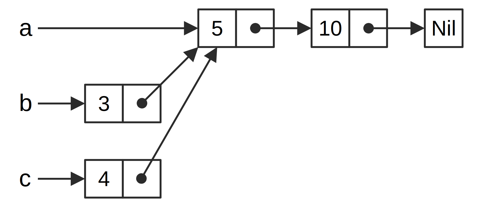

## Der referenzzählende intelligente Zeiger `Rc<T>`

In den meisten Fällen ist die Eigentümerschaft klar, man weiß genau, welche
Variable einen bestimmten Wert besitzt. Es gibt jedoch Fälle, in denen ein
einzelner Wert mehrere Eigentümer haben kann. In Diagrammdatenstrukturen 
(graph data structures) können beispielsweise mehrere Kanten auf denselben Knoten
verweisen, und dieser Knoten gehört konzeptionell allen Kanten, die darauf
verweisen. Ein Knoten sollte nur bereinigt werden, wenn keine Kanten darauf zeigen.

Um Mehrfacheigentum zu ermöglichen, hat Rust einen Typ namens `Rc<T>`, was eine
Kurzform für *Referenzzählung* (reference counting) ist. Der Typ `Rc<T>`
beobachtet die Anzahl der Referenzen auf einen Wert, der bestimmt, ob der Wert
noch verwendet wird oder nicht. Wenn auf einen Wert keine Referenz vorhanden
ist, kann der Wert bereinigt werden, ohne dass Referenzen ungültig werden.

Stell dir `Rc<T>` als einen Fernseher im Wohnzimmer vor. Wenn eine Person zum
Fernsehen hereinkommt, schaltet sie ein. Andere können in das Zimmer kommen und
fernsehen. Wenn die letzte Person den Raum verlässt, schaltet sie den Fernseher
aus, da er nicht mehr verwendet wird. Wenn jemand den Fernseher ausschaltet,
während andere noch fernsehen möchten, wird es Aufruhr bei den übrigen
Zuschauern geben!

Wir verwenden den Typ `Rc<T>`, wenn wir Daten auf dem Haldenspeicher allokieren
möchten, damit mehrere Teile unseres Programms diese lesen können,
und wir können zum Zeitpunkt der Kompilierung nicht bestimmen, welcher Teil
zuletzt fertig sein würde. Wenn wir wüssten, welcher Teil zuletzt fertig sein
würde, könnten wir diesen Teil einfach zum Eigentümer der Daten machen, und die
Eigentumsregeln, die zur Kompilierzeit durchgesetzt werden, würden wirksam.

Beachte, dass `Rc<T>` nur in einsträngigen (single-threaded) Szenarien verwendet
werden kann. Wenn wir in Kapitel 16 auf Nebenläufigkeit (concurrency) eingehen,
werden wir uns mit der Referenzzählung in mehrsträngigen (multi-threaded)
Programmen befassen.

### `Rc<T>` zur gemeinsamen Nutzung von Daten verwenden

Kehren wir zu unserem Beispiel für die Cons-Liste in Codeblock 15-5 zurück.
Denke daran, dass wir es mit `Box<T>` definiert haben. Dieses Mal erstellen
wir zwei Listen, die beide gemeinsam eine dritte Liste besitzen. Konzeptionell
sieht dies ähnlich aus wie in Abbildung 15-3:



<span class="caption">Abbildung 15-3: Zwei Listen `b` und `c` teilen sich 
die Eigentümerschaft über eine dritte Liste `a`</span>

Wir erstellen eine Liste `a`, die 5 und dann 10 enthält. Dann erstellen wir zwei
weitere Listen: `b`, die mit 3 beginnt, und `c`, die mit 4 beginnt. Sowohl
`b` als auch `c` werden dann mit mit der ersten Liste `a` fortfahren, die 5 und
10 enthält. Mit anderen Worten, beide Listen teilen sich die erste Liste mit 5
und 10.

Der Versuch, dieses Szenario mithilfe unserer Definition von `List` mit `Box<T>`
zu implementieren, funktioniert nicht, wie in Codeblock 15-17 gezeigt:


<span class="filename">Dateiname: src/main.rs</span>

```rust,does_not_compile
enum List {
    Cons(i32, Box<List>),
    Nil,
}

use crate::List::{Cons, Nil};

fn main() {
    let a = Cons(5, Box::new(Cons(10, Box::new(Nil))));
    let b = Cons(3, Box::new(a));
    let c = Cons(4, Box::new(a));
}
```

<span class="caption">Codeblock 15-17: Dies zeigt, dass wir mit `Box<T>` keine
zwei Listen haben dürfen, die versuchen, die Eigentümerschaft einer dritten Liste zu
teilen</span>

Beim Versuch den Programmcode zu kompilieren, erhalten wir folgende Fehlermeldung:

```console
$ cargo run
   Compiling cons-list v0.1.0 (file:///projects/cons-list)
error[E0382]: use of moved value: `a`
  --> src/main.rs:11:30
   |
9  |     let a = Cons(5, Box::new(Cons(10, Box::new(Nil))));
   |         - move occurs because `a` has type `List`, which does not implement the `Copy` trait
10 |     let b = Cons(3, Box::new(a));
   |                              - value moved here
11 |     let c = Cons(4, Box::new(a));
   |                              ^ value used here after move

For more information about this error, try `rustc --explain E0382`.
error: could not compile `cons-list` due to 2 previous errors
```

Die `Cons`-Varianten besitzen die Daten, die sie enthalten. Wenn wir also die
`b`-Liste erstellen, wird `a` in `b` verschoben und `b` besitzt `a`. Wenn wir
dann beim Erstellen von `c` versuchen erneut `a` zu verwenden, ist dies nicht
zulässig, da `a` verschoben wurde.

Wir könnten die Definition von `Cons` ändern, um stattdessen Referenzen zu
erhalten, aber dann müssten wir Lebensdauerparameter (lifetime parameters)
angeben. Durch die Angabe von Lebensdauerparametern würden wir angeben, dass
jedes Element in der Liste mindestens so lange wie die gesamte Liste lebt. Mit
dem Ausleihenprüfer (borrow checker) können wir beispielsweise `let a =
Cons(10, &Nil);` nicht kompilieren, da der temporäre `Nil`-Wert aufgeräumt
wird, bevor `a` darauf referenzieren kann.

Stattdessen ändern wir unsere Definition von `List` so, dass `Rc<T>` anstelle
von `Box<T>` verwendet wird, wie in Codeblock 15-18 gezeigt. Jede
`Cons`-Variante enthält nun einen Wert und ein `Rc<T>`, das auf eine `List`
zeigt. Wenn wir `b` erstellen, klonen wir, anstatt `a` zu übernehmen, die
`Rc<List>`, die `a` enthält, und erhöhen die Anzahl der Referenzen von eins auf
zwei und lassen `a` und `b` die Eigentümerschaft (ownership) an den Daten dieser `Rc<List>`
teilen. Wir werden auch `a` klonen, wenn wir `c` erstellen, wodurch die Anzahl
der Referenzen von zwei auf drei erhöht wird. Jedes Mal, wenn wir `Rc::clone`
aufrufen, erhöht sich die Anzahl der Referenzen auf die Daten in der
`Rc<List>`, und die Daten werden erst dann bereinigt, wenn keine Referenzen
darauf vorhanden sind.

<span class="filename">Dateiname: src/main.rs</span>

```rust
enum List {
    Cons(i32, Rc<List>),
    Nil,
}

use crate::List::{Cons, Nil};
use std::rc::Rc;

fn main() {
    let a = Rc::new(Cons(5, Rc::new(Cons(10, Rc::new(Nil)))));
    let b = Cons(3, Rc::clone(&a));
    let c = Cons(4, Rc::clone(&a));
}
```

<span class="caption">Codeblock 15-18: Eine Definition von `List` die `Rc<T>`
verwendet</span>

Wir müssen eine `use`-Anweisung hinzufügen, um `Rc<T>` in den
Gültigkeitsbereich (scope) zu bringen, da sie nicht im Präludium (prelude) ist.
In `main` erstellen wir die Liste mit 5 und 10 und speichern sie in einem neuen
`Rc<List>` in `a`. Wenn wir dann `b` und `c` erstellen, rufen wir die Funktion
`Rc::clone` auf und übergeben eine Referenz auf `Rc<List>` in `a` als Argument.

Wir hätten `a.clone()` anstelle von `Rc::clone(&a)` aufrufen können, aber Rusts
Konvention lautet in diesem Fall `Rc::clone`. Die Implementierung von `Rc::clone`
erstellt keine tiefe Kopie aller Daten, wie es bei den meisten Implementierungen
von `clone` der Fall ist. Der Aufruf von `Rc::clone` erhöht nur den
Referenzzähler, was nicht viel Zeit in benötigt. Tiefe Kopien von Daten
können viel Zeit in Anspruch nehmen. Durch die Verwendung von `Rc::clone` für
die Referenzzählung können wir visuell zwischen den Arten von Klonen mit tiefer
Kopie und Klonen, die den Referenzzähler erhöhen, unterscheiden. Bei
der Suche nach Performanzproblemen im Code müssen wir nur die Klone mit tiefer
Kopie berücksichtigen und können die Aufrufe von `Rc::clone` ignorieren.

### `Rc<T>` zu klonen erhöht den Referenzzähler

Lass uns unser Arbeitsbeispiel in Codeblock 15-18 ändern, damit sich die
Referenzanzahl ändert, wenn wir Referenzen auf `Rc<List>` in `a` erstellen
und löschen.

In Codeblock 15-19 ändern wir `main`, damit es einen inneren Gültigkeitsbereich um die
Liste `c` hat, so können wir sehen, wie sich der Referenzzähler ändert, wenn `c`
den Gültigkeitsbereich verlässt.

<span class="filename">Dateiname: src/main.rs</span>

```rust
# enum List {
#     Cons(i32, Rc<List>),
#     Nil,
# }
# 
# use crate::List::{Cons, Nil};
# use std::rc::Rc;
# 
fn main() {
    let a = Rc::new(Cons(5, Rc::new(Cons(10, Rc::new(Nil)))));
    println!("Zähler nach der Erstellung von a = {}", Rc::strong_count(&a));
    let b = Cons(3, Rc::clone(&a));
    println!("Zähler nach der Erstellung von b = {}", Rc::strong_count(&a));
    {
        let c = Cons(4, Rc::clone(&a));
        println!("Zähler nach der Erstellung von c = {}", Rc::strong_count(&a));
    }
    println!("Zahler nachdem c den Gültigkeitsbereich verlässt = {}", Rc::strong_count(&a));
}
```

<span class="caption">Codeblock 15-19: Den Referenzzähler ausgeben</span>

An jeden Punkt im Programm, an dem sich der Referenzzähler ändert, geben wir
den Referenzzähler aus, den wir durch Aufrufen der Funktion `Rc::strong_count`
erhalten können. Diese Funktion heißt `strong_count` und nicht `count`, da der
Typ `Rc<T>` auch eine Funktion `weak_count` hat. Wir werden im Abschnitt
[„Verhindern von Referenzzyklen: `Rc<T>` in `Weak<T>`
verwandeln“][preventing-ref-cycles] sehen wofür `weak_count` verwendet wird.

Dieser Programmcode gibt folgendes aus:


```console
$ cargo run
   Compiling cons-list v0.1.0 (file:///projects/cons-list)
    Finished dev [unoptimized + debuginfo] target(s) in 0.45s
     Running `target/debug/cons-list`
Zähler nach der Erstellung von a = 1
Zähler nach der Erstellung von b = 2
Zähler nach der Erstellung von c = 3
Zahler nachdem c den Gültigkeitsbereich verlässt = 2
```

Wir sehen, dass `Rc<List>` in `a` einen anfänglichen Referenzzähler
von 1 hat. Jedes Mal wenn wir `clone` aufrufen, steigt die Anzahl um 1. Wenn `c`
den Gültigkeitsbereich verlässt, sinkt die Anzahl um 1. Wir müssen keine
Funktion aufrufen, um den Referenzzähler wie erforderlich zu verringern,
während wir `Rc::clone` aufrufen müssen, um den Referenzzähler zu erhöhen: Die
Implementierung des Merkmals (trait) `Drop` verringert den Referenzzähler
automatisch, wenn ein `Rc<T>`-Wert den Gültigkeitsbereich verlässt.

Was wir in diesem Beispiel nicht sehen können, ist, dass wenn `b` und dann `a`
am Ende von `main` den Gültigkeitsbereich verlassen, der Zähler 0 ist und
`Rc<List>` an diesem Punkt vollständig bereinigt wird. Durch die Verwendung von
`Rc<T>` kann ein einzelner Wert mehrere Eigentümer haben und der Zähler stellt
sicher, dass der Wert gültig bleibt, solange ein Eigentümer vorhanden ist.

Über unveränderliche (immutable) Referenzen kann man mit `Rc<T>` Daten zwischen
mehreren Teilen eines Programms zum Lesen austauschen. Wenn man mit `Rc<T>`
auch mehrere veränderliche (mutable) Referenzen haben könnte, verstößt man
möglicherweise gegen eine der in Kapitel 4 beschriebenen Ausleihregeln: Mehrere
veränderlich ausgeliehene Referenzen an derselben Stelle können zu
Daten-Wettlaufsituationen (data races) und Inkonsistenzen führen. Es ist jedoch
sehr nützlich, Daten verändern zu können! Im nächsten Abschnitt werden wir das
innere Veränderlichkeitsmuster und den Typ `RefCell<T>` erläutern, den man in
Verbindung mit `Rc<T>` verwenden kann, um mit dieser
Unveränderlichkeitsbeschränkung zu arbeiten.

[preventing-ref-cycles]:
ch15-06-reference-cycles.html#preventing-reference-cycles-turning-an-rct-into-a-weakt
