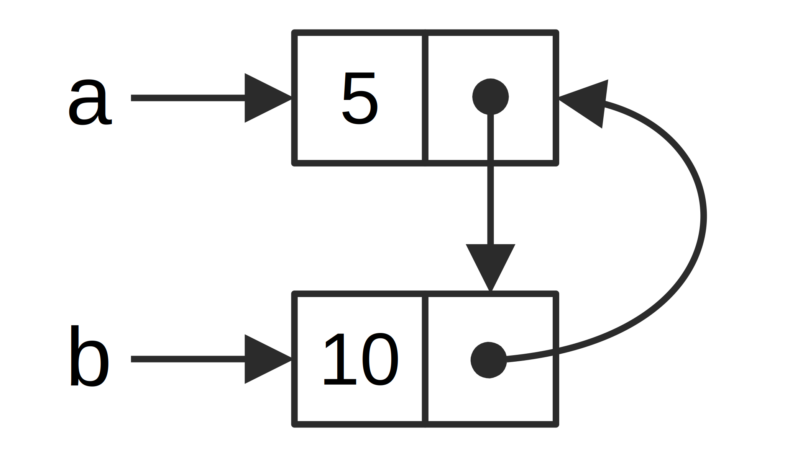

### Referenzzyklen können zu einem Speicherleck führen

Die Speichersicherheitsgarantien von Rust machen es schwierig, aber nicht
unmöglich, versehentlich Speicher zu erstellen, der niemals bereinigt wird
(bekannt als *Speicherleck* (memory leak)). Das vollständige Verhindern von
Speicherlecks ist keine der Garantien von Rust, ebenso wie das Nichtzulassen von
Daten-Wettlaufsituationen zur Kompilierungszeit. Dies bedeutet, dass
Speicherlecks in Rust speichersicher sind. Wir können sehen, dass Rust
Speicherlecks mithilfe von `Rc<T>` und `RefCell<T>` zulässt: Es ist möglich,
Referenzen zu erstellen, bei denen Elemente in einem Zyklus aufeinander
verweisen. Dies führt zu Speicherlecks, da der Referenzzähler jedes Elements im
Zyklus niemals 0 erreicht und die Werte niemals gelöscht werden.

### Einen Referenzzyklus erstellen

Schauen wir uns an, wie ein Referenzzyklus stattfinden kann und wie er verhindert
werden kann, beginnend mit der Definition der Aufzählung `List` und einer
Methode `tail` in Codeblock 16-25:


<span class="filename">Filename: src/main.rs</span>

```rust
use crate::List::{Cons, Nil};
use std::cell::RefCell;
use std::rc::Rc;

#[derive(Debug)]
enum List {
    Cons(i32, RefCell<Rc<List>>),
    Nil,
}

impl List {
    fn tail(&self) -> Option<&RefCell<Rc<List>>> {
        match self {
            Cons(_, item) => Some(item),
            Nil => None,
        }
    }
}

fn main() {}
```

<span class="caption">Codeblock 15-25: Eine Definition einer Cons-Liste 
die einen `RefCell<T>` damit man die `Cons` Variante ändern kann, auf die referenziert 
wird </span>

Wir verwenden eine andere Variante der `List`-Definition aus Codeblock 15-5 Das
zweite Element in der `Cons`-Variante ist jetzt `RefCell<Rc<List>>`. Dies
bedeutet, dass wir anstelle der Möglichkeit, den `i32`-Wert wie in Codeblock
15-24 zu ändern, den `List`-Wert einer `Cons`-Variante ändern auf den sie zeigt.
Wir fügen eine `tail`-Methode hinzu, damit wir bequem auf das zweite Element
zugreifen können, wenn wir eine `Cons`-Variante haben.

In Codeblock 15-26 fügen wir eine Hauptfunktion hinzu, die die Definitionen in
Codeblock 15-25 verwendet. Dieser Code erstellt eine Liste in `a` und eine Liste
`b`, die auf die Liste in `a` verweist. Anschließend wird die Liste in `a` so
geändert, dass sie auf `b` zeigt, wodurch ein Referenzzyklus erstellt wird. Es
gibt `println!`-Anweisungen auf dem Weg, um zu zeigen, wie hoch die
Referenzzählungen an verschiedenen Punkten in diesem Prozess sind.

<span class="filename">Dateiname: src/main.rs</span>

```rust
# use crate::List::{Cons, Nil};
# use std::cell::RefCell;
# use std::rc::Rc;
# 
# #[derive(Debug)]
# enum List {
#     Cons(i32, RefCell<Rc<List>>),
#     Nil,
# }
# 
# impl List {
#     fn tail(&self) -> Option<&RefCell<Rc<List>>> {
#         match self {
#             Cons(_, item) => Some(item),
#             Nil => None,
#         }
#     }
# }
# 
fn main() {
    let a = Rc::new(Cons(5, RefCell::new(Rc::new(Nil))));

    println!("a anfängliche Rc-Zählung = {}", Rc::strong_count(&a));
    println!("a nächstes Element = {:?}", a.tail());

    let b = Rc::new(Cons(10, RefCell::new(Rc::clone(&a))));

    println!("a Rc-Zählung nach erstellen von b = {}", Rc::strong_count(&a));
    println!("b anfängliche Rc-Zählung = {}", Rc::strong_count(&b));
    println!("b nächstes Element = {:?}", b.tail());

    if let Some(link) = a.tail() {
        *link.borrow_mut() = Rc::clone(&b);
    }

    println!("b Rc-Zählung nach Änderung von a = {}", Rc::strong_count(&b));
    println!("a Rc-Zählung nach Änderung von a = {}", Rc::strong_count(&a));

    // Uncomment the next line to see that we have a cycle;
    // it will overflow the stack
    // println!("a next item = {:?}", a.tail());
}
```

<span class="caption">Codeblock 15-26: Erstellen eines Referenzzyklus aus zwei
aufeinander zeigenden Listenwerten</span>

Wir erstellen eine `Rc<List>`-Instanz, die einen `List`-Wert in der Variablen `a`
mit einer initialen Liste `5, Nil` enthält. Wir erstellen dann eine
`Rc<List>`-Instanz, die einen anderen `List`-Wert in der Variablen `b` enthält,
die den Wert 10 enthält und auf die Liste in `a` zeigt.

Wir modifizieren `a`so, dass es auf `b` anstatt auf `Nil` zeigt, wodurch ein
Zyklus erstellt wird. Wir tun dies, indem wir die `tail`-Methode verwenden, um
einen Verweis auf die `RefCell<Rc<List>>` in `a` zu erhalten, die wir in die
Variable `link` einfügen. Dann verwenden wir die `borrow_mut`-Methode für
`RefCell<Rc<List>>`, um den Wert von `Rc<List>`, der einen `Nil`-Wert enthält,
in `Rc<List>` in `b` zu ändern.

Wenn wir diesen Programmcode ausführen und das letzte `println!`
auskommentieren, erhalten wir folgende Ausgabe:


```console
$ cargo run
   Compiling cons-list v0.1.0 (file:///projects/cons-list)
    Finished dev [unoptimized + debuginfo] target(s) in 0.53s
     Running `target/debug/cons-list`
a anfängliche Rc-Zählung = 1
a nächstes Element = Some(RefCell { value: Nil })
a Rc-Zählung nach erstellen von b = 2
b anfängliche Rc-Zählung = 1
b nächstes Element = Some(RefCell { value: Cons(5, RefCell { value: Nil }) })
b Rc-Zählung nach Änderung von a = 2
a Rc-Zählung nach Änderung von a = 2     
```

Der Referenzzähler der `Rc<List>`-Instanzen in `a` und `b` beträgt 2, nachdem
wir die Liste in `a` so geändert haben, dass sie auf `b` zeigt. Am Ende von
`main` versucht Rust, zuerst `b` zu löschen, wodurch der Zähler der
`Rc<Liste>`-Instanz in `b` um 1 verringert wird.

Da `a` jedoch immer noch auf die `Rc<Liste>` verweist, die sich in `b` befand,
hat `Rc<Liste>` eine Zählung von 1 anstelle von 0, also den Speicher, den
`Rc<List>` hat auf dem Haldenspeicher wird nicht verworfen.



<span class="caption">Abbildung 15-4: Ein Referenzzyklus der Listen `a` und `b`,
die aufeinander zeigen</span>

Wenn man das letzte `println!` auskommentiert und das Programm ausführt,
versucht Rust, diesen Zyklus mit `a` auszugeben, wobei `b` auf `a` zeigt, und so
weiter, bis der Stapelspeicher überläuft.

In diesem Fall endet das Programm direkt nach dem Erstellen des Referenzzyklus.
Die Folgen dieses Zyklus sind nicht sehr schlimm. Wenn jedoch einen komplexeren
Programm in einem Zyklus viel Speicher zugewiesen wird und lange Zeit daran
festhält, verbraucht das Programm mehr Speicher als erforderlich und überlastet
das System möglicherweise, sodass ihm der verfügbare Speicher ausgeht.

Das Erstellen von Referenzzyklen ist nicht einfach, aber auch nicht unmöglich.
Wenn man `RefCell<T>`-Werte hat, die `Rc<T>`-Werte oder ähnliche verschachtelte
Typkombinationen mit innerer Veränderlichkeit und Referenzzählung enthalten,
muss man sicherstellen, dass man keine Zyklen erstellt. Man kann sich nicht
darauf verlassen, dass Rust sie feststellen kann. Das Erstellen eines
Referenzzyklus wäre ein logischer Fehler in Ihrem Programm, den sie mithilfe
automatisierter Tests, Codeüberprüfungen und anderer Methoden zur
Softwareentwicklung minimieren sollten.

Eine andere Lösung zur Vermeidung von Referenzzyklen besteht darin, Ihre
Datenstrukturen so zu reorganisieren, dass einige Referenzen die
Eigentümerschaft erhalten und andere nicht. Infolgedessen können Zyklen
bestehen, die aus einigen Verhältnissen mit Eigentümerschaft und einigen ohne
bestehen, und nur die Verhältnisse mit Eigentümerschaft beeinflussen, ob ein
Wert gelöscht wird oder nicht. In Codeblock 15-25 möchten wir immer, dass
`Cons`-Varianten ihre Liste besitzen, sodass eine Neuorganisation der
Datenstruktur nicht möglich ist. Schauen wir uns ein Beispiel an, in dem
Diagramme aus übergeordneten und untergeordneten Knoten verwendet werden, um
festzustellen, wann Verhältnisse ohne Eigentümerschaft ein geeigneter Weg sind,
um Referenzzyklen zu verhindern.

### Verhindern von Referenzzyklen: Verwandeln einen `Rc<T>` in einen `Weak<T>`

Bisher haben wir gezeigt, dass das Aufrufen von `Rc::clone` den `strong_count`
einer `Rc<T>`-Instanz nur bereinigt wird, wenn ihr `strong_count` 0 ist. Man
kann auch einen *schwachen Verweis* auf den Wert innerhalb einer `Rc<T>`-Instanz
erstellen, indem man `Rc::downgrade` aufruft und einen Verweis auf den `Rc<T>`
übergibt. Wenn man `Rc::downgrade` aufruft, erhält man einen intelligenten
Zeiger vom Typ `Weak<T>`. Anstatt den `strong_count` in der `Rc<T>`-Instanz um 1
zu erhöhen, erhöht der Aufruf von `Rc::downgrade` den `weak_count` um 1. Der Typ
`Rc<T>` verwendet `weak_count`, um den Überblick zu behalten wie viele `Weak<T>`
Referenzen existieren, ähnlich wie bei `strong_count`. Der Unterschied besteht
darin, dass `weak_count` nicht 0 sein muss, damit die `Rc<T>`-Instanz bereinigt
wird.

Mit starken Referenzen kann man die Eigentümerschaft einer `Rc<T>`-Instanz
teilen, schwache Referenzen drücken hingegen keine Eigentümerschaft-Verhältnisse
aus. Sie verursachen keinen Referenzzyklus, da jeder Zyklus mit einigen
schwachen Referenzen unterbrochen wird, sobald die starke Referenzanzahl (strong
count) der beteiligten Werte 0 beträgt.

Da der Wert, auf den `Weak<T>` zeigt, möglicherweise gelöscht wurde, müssen
sie sicherstellen, dass der Wert noch vorhanden ist, um etwas mit dem Wert zu
tun, auf dem ein `Weak<T>` zeigt. Ruft man dazu die Methode `upgrade` für eine
`Weak<T>`-Instanz auf, die eine `Option<Rc<T>>`zurückgibt, erhält man ein `Some`
als Ergebnis, wenn der Wert `Rc<T>` noch nicht gelöscht wurde, und ein Ergebnis
von `None`, wenn der `Rc<T>`-Wert gelöscht wurde. Da `upgrade` eine
`Option<Rc<T>>` zurückgibt, stellt Rust sicher, dass der Fall `Some` und der
Fall `None` behandelt wird und es keine ungültigen Zeiger gibt.

Anstatt eine Liste zu verwenden, deren Elemente nur das nächste Element kennen,
erstellen wir eine Baumstruktur, dessen Elemente sie untergeordneten Elemente 
*und* die übergeordneten Elemente kennen.
	
#### Erstellen einer Baumdatenstruktur: Ein Knoten mit untergeordneten Knoten

Zunächst erstellen wir eine Baumstruktur mit Knoten (Node), die über ihre
untergeordneten Knoten Bescheid wissen. Wir erstellen eine Struktur mit dem
Namen `Node`, die ihren eigenen `i32`-Wert sowie Referenzen auf die
untergeordneten `Node`-Werte enthält:

<span class="filename">Filename: src/main.rs</span>

```rust
use std::cell::RefCell;
use std::rc::Rc;

#[derive(Debug)]
struct Node {
    value: i32,
    children: RefCell<Vec<Rc<Node>>>,
}
# fn main() {
#     let leaf = Rc::new(Node {
#         value: 3,
#         children: RefCell::new(vec![]),
#     });
# 
#     let branch = Rc::new(Node {
#         value: 5,
#         children: RefCell::new(vec![Rc::clone(&leaf)]),
#     });
# }
```

Wir möchten, dass ein `Knoten` seine untergeordneten Elemente besitzt, und wir
möchten diesen Besitz mit Variablen teilen, damit wir direkt auf jeden `Knoten` in
der Baumstruktur zugreifen können. Zu diesem Zweck definieren wir die Elemente
`Vec<T>` als Werte vom Typ `Rc<Node>`. Wir möchten auch ändern, welche Knoten
untergeordnete Knoten eines anderen Knotens sind, sodass wir einen `RefCell<T>`
in `children` um den `Vec<Rc<Node>>` haben.

Als nächstes verwenden wir unsere Strukturdefinition und erstellen ein
`Knoten`-Instanz mit dem Namen `leaf` mit dem Wert 3 und ohne untergeordnete
Elemente sowie eine weitere Instanz mit dem Namen `branch` mit dem Wert 5 und
`leaf` als eines ihrer untergeordneten Elemente, wie es in Codeblock 15-27
gezeigt wird:


<span class="filename">Dateiname: src/main.rs</span>

```rust
# use std::cell::RefCell;
# use std::rc::Rc;
# 
# #[derive(Debug)]
# struct Node {
#     value: i32,
#     children: RefCell<Vec<Rc<Node>>>,
# }
fn main() {
    let leaf = Rc::new(Node {
        value: 3,
        children: RefCell::new(vec![]),
    });

    let branch = Rc::new(Node {
        value: 5,
        children: RefCell::new(vec![Rc::clone(&leaf)]),
    });
}
```

<span class="caption">Codeblock 15-27: Erstellen eines `leaf`-Knotens ohne untergeordnete
Elemente und einen `branch`-Knoten mit `leaf` als untergeordnetes Element</span>

Wir klonen den `Rc<Node>` in `leaf` und speichern ihn in `branch`, was bedeutet,
dass der `Knoten` in `leaf` jetzt zwei Eigentümer hat: `leaf` und `branch`. Wir
können über `branch.children` von `branch` zu `leaf` gelangen, aber es gibt
keine Möglichkeit, von `leaf` zu `branch` zu gelangen. Der Grund dafür ist, dass
`leaf` keine Referenz zu `branch` hat und daher nicht weiß, dass diese in
Beziehung stehen. Wir möchten, dass `leaf` weiß, dass `branch` ein
übergeordnetes Element ist. Das machen wir als nächstes.

#### Hinzufügen einer Referenz von einem untergeordneten zu seinen übergeordneten Element

Um den untergeordneten Knoten auf seinen übergeordneten Knoten aufmerksam zu
machen, müssen wir unserer Strukturdefinition `Node` ein `parent`-Feld
hinzufügen. Das Problem besteht darin, zu entscheiden, welcher Typ `parent` sein
soll. Wir wissen, dass es keinen `Rc<T>` enthalten kann, da dies einen
Referenzzyklus erzeugen würde, bei dem `leaf.parent` auf `branch` und
`branch.children` auf `leaf` zeigt, was dazu führen würde das die 
`strong_count`- Werte niemals 0 sein würden.

Wenn man die Beziehungen auf andere Weise betrachten, sollte ein übergeordneter
die Eigentümerschaft seiner untergeordneten Knoten besitzen: Wenn ein
übergeordneter Knoten gelöscht wird, sollten auch seine untergeordneten Knoten
gelöscht werden. Ein untergeordneter Knoten sollte jedoch keine Eigentümerschaft
eines übergeordneten Elementes haben: Wenn wir einen untergeordneten Knoten
löschen, sollte das übergeordnete Element weiterhin vorhanden sein. Dies ist ein
Fall für schwache Referenzen!

Anstelle von `Rc<T>` wird `parent` den Typ `Weak<T>` verwenden, im Speziellen
einen `RefCell<Weak<Node>>`. Nun sieht unsere `Node`-Strukturdefinition
folgendermaßen aus:

<span class="filename">Filename: src/main.rs</span>

```rust
use std::cell::RefCell;
use std::rc::{Rc, Weak};

#[derive(Debug)]
struct Node {
    value: i32,
    parent: RefCell<Weak<Node>>,
    children: RefCell<Vec<Rc<Node>>>,
}
# fn main() {
#     let leaf = Rc::new(Node {
#         value: 3,
#         parent: RefCell::new(Weak::new()),
#         children: RefCell::new(vec![]),
#     });
# 
#     println!("leaf parent = {:?}", leaf.parent.borrow().upgrade());
# 
#     let branch = Rc::new(Node {
#         value: 5,
#         parent: RefCell::new(Weak::new()),
#         children: RefCell::new(vec![Rc::clone(&leaf)]),
#     });
# 
#     *leaf.parent.borrow_mut() = Rc::downgrade(&branch);
# 
#     println!("leaf parent = {:?}", leaf.parent.borrow().upgrade());
# }
```

Ein Knoten kann auf seinen übergeordneten verweisen, besitzt jedoch keine
Eigentümerschaft darauf. In Codeblock 15-28 aktualisieren wir `main`, um diese
neue Definition zu verwenden, damit der `leaf`-Knoten auf seinen übergeordneten
Knoten `branch` verweisen kann:

<span class="filename">Dateiname: src/main.rs</span>

```rust
# use std::cell::RefCell;
# use std::rc::{Rc, Weak};
# 
# #[derive(Debug)]
# struct Node {
#     value: i32,
#     parent: RefCell<Weak<Node>>,
#     children: RefCell<Vec<Rc<Node>>>,
# }
fn main() {
    let leaf = Rc::new(Node {
        value: 3,
        parent: RefCell::new(Weak::new()),
        children: RefCell::new(vec![]),
    });

    println!("leaf parent = {:?}", leaf.parent.borrow().upgrade());

    let branch = Rc::new(Node {
        value: 5,
        parent: RefCell::new(Weak::new()),
        children: RefCell::new(vec![Rc::clone(&leaf)]),
    });

    *leaf.parent.borrow_mut() = Rc::downgrade(&branch);

    println!("leaf parent = {:?}", leaf.parent.borrow().upgrade());
}
```

<span class="caption">Codeblock 15-28: Ein `leaf`-Knoten mit einer schwachen
Referenz auf seinen übergeordneten Knoten `branch`</span>

Das Erstellen des `leaf`-Knotens ähnelt dem Erstellen des `leaf`-Knotens in
Codeblock 15-27 mit der Ausnahme das das Feld `parents`: `leaf` beginnt ohne
Eltern, daher erstellen wir eine neue leere `Weak<Node>`-Referenz-Instanz.

Wenn wir zu diesem Zeitpunkt versuchen, mit der Methode `upgrade` eine
Referenz auf das übergeordnete Element von `leaf` zu bekommen, erhalten wir den
Wert `None`. Wir sehen dies in der Ausgabe der ersten `println!`-Anweisung:

```text
leaf parent = None
```

Wenn wir den `branch`-Knoten erstellen, hat er auch eine neue `Weak<Node>`-Referenz
im übergeordneten Feld, da `branch` keinen übergeordneten Knoten hat. Wir haben
immer noch `leaf` als eines der untergeordneten Elemente von `branch`. Sobald
wir die `Node`-Instanz in `branch` haben, können wir `leaf` ändern, um ihm eine
`Weak<Node>`-Referenz auf sein übergeordnetes Element zu geben. Wir verwenden
die `bor_mut`-Methode für `RefCell<Weak<Node>>` im `parent`-Feld von `leaf` und
verwenden dann die Funktion `Rc::downgrade`, um eine `Weak<Node>`-Referenz auf
`branch` aus dem `Rc<Node>` in `branch`.

Wenn wir das übergeordnete Element von `leaf` erneut ausgeben, erhalten wir
diesmal eine `Some`-Variante mit `branch`: Jetzt kann `leaf` auf das
übergeordnete Element zugreifen! Wenn wir `leaf` ausgeben, vermeiden wir auch
den Zyklus, der schließlich zu einem Stapelspeicherüberlauf führte, wie wir ihn
in Codeblock 15-26 hatten. Die `Weak<Node>`-Referenzen werden als `(Weak)`
ausgegeben:


```text
leaf parent = Some(Node { value: 5, parent: RefCell { value: (Weak) },
children: RefCell { value: [Node { value: 3, parent: RefCell { value: (Weak) },
children: RefCell { value: [] } }] } })
```

Das Fehlen einer unendlichen Ausgabe bedeutet, dass dieser Programmcode keinen
Referenzzyklus erzeugt hat. Wir können dies auch anhand der Werte erkennen, die
wir durch den Aufruf von `Rc::strong_count` und `Rc::weak_count` erhalten.

#### Visualisieren von Änderungen an `strong_count` und `weak_count`

Schauen wir uns an, wie sich die Werte für `strong_count` und `weak_count` der
`Rc<Node>`-Instanzen ändern, indem ein neuer innerer Gültigkeitsbereich
erstellt und die Erstellung von `branch` in diesen Bereich verschoben wird. Auf
diese Weise können wir sehen, was passiert, wenn `branch` erstellt und dann
gelöscht wird, wenn der Gültigkeitsbereich überschritten wird. Die Änderungen
sind in Codeblock 15-29 aufgeführt:

<span class="filename">Dateiname: src/main.rs</span>

```rust
# use std::cell::RefCell;
# use std::rc::{Rc, Weak};
# 
# #[derive(Debug)]
# struct Node {
#     value: i32,
#     parent: RefCell<Weak<Node>>,
#     children: RefCell<Vec<Rc<Node>>>,
# }
fn main() {
    let leaf = Rc::new(Node {
        value: 3,
        parent: RefCell::new(Weak::new()),
        children: RefCell::new(vec![]),
    });

    println!(
        "leaf strong = {}, weak = {}",
        Rc::strong_count(&leaf),
        Rc::weak_count(&leaf),
    );

    {
        let branch = Rc::new(Node {
            value: 5,
            parent: RefCell::new(Weak::new()),
            children: RefCell::new(vec![Rc::clone(&leaf)]),
        });

        *leaf.parent.borrow_mut() = Rc::downgrade(&branch);

        println!(
            "branch strong = {}, weak = {}",
            Rc::strong_count(&branch),
            Rc::weak_count(&branch),
        );

        println!(
            "leaf strong = {}, weak = {}",
            Rc::strong_count(&leaf),
            Rc::weak_count(&leaf),
        );
    }

    println!("leaf parent = {:?}", leaf.parent.borrow().upgrade());
    println!(
        "leaf strong = {}, weak = {}",
        Rc::strong_count(&leaf),
        Rc::weak_count(&leaf),
    );
}
```

<span class="caption">Codeblock 15-29: Creating `branch` in an inner scope and
examining strong and weak reference counts</span>

Nachdem `leaf` erstellt wurde, hat `Rc<Node>` einen `strong_count` von 1 und
einen `weak_count` von 0. Im inneren Bereich erstellen wir `branch` und ordnen
ihn `leaf` zu, zum Zeitpunkt des Ausgebens der Zähler, hat der `Rc<Node>` in
`branch` eine `strong_count` von 1 und eine `weak_count` von 1 (da `leaf.parent`
mit einen `Weak<Node>` auf `branch` zeigt). Wenn wir den Zähler in `leaf`
ausgeben, werden wir sehen, dass es eine `strong_count` von 2 hat, da `branch`
jetzt einen Klon des `Rc<Node>` von `leaf` in `branch.children` gespeichert hat,
aber immer noch eine `weak_count`von 0 hat.

Wenn der innere Gültigkeitsbereich endet, verlässt `branch` den
Gültigkeitsbereich und die `strong_count` von `Rc<Node>` sinkt auf 0, sodass
sein `Node` gelöscht wird. Die `weak_count` von 1 aus `leaf_parent` hat keinen
Einfluss darauf, ob `Node` gelöscht wird oder nicht, sodass wir keine
Speicherlecks bekommen!

Wenn wir nach dem Ende des Bereichs versuchen, auf das übergeordnete Element von
`leaf` zuzugreifen, erhalten wir erneut `None`. Am Ende des Programms hat der
`Rc<Node>` in `branch` eine `strong_count` von 1 und eine `weak_count` von 0, da
die Variable `branch` jetzt wieder die einzige Referenz auf `Rc<Node>`.

Die gesamte Logik, die die Anzahl und Löschung des Wertes verwaltet, ist in
`Rc<T>` und `Weak<T>` und deren Implementierung des Merkmals `Drop` integriert.
Wenn man angibt, dass die Beziehung von einem untergeordneten Element zu seinem
übergeordneten eine `Weak<T>`-Referenz in der Definition von `Node` sein soll,
können übergeordnete Knoten auf untergeordnete Knoten verweisen und umgekehrt,
ohne einen Referenzzyklus oder Speicherlecks zu erzeugen.

## Zusammenfassung

In diesem Kapitel wurde beschrieben, wie man mithilfe intelligenter Zeiger
andere Garantien und Kompromisse eingehen als es standardmäßig mit gewöhnlichen
Referenzen in Rust möglich ist. Der Typ `Box<T>` hat eine bekannte Größe und
zeigt auf Daten die auf dem Haldenspeicher zugeordnet sind. Der Typ `Rc<T>`
verfolgt die Anzahl der Referenzen von Daten auf dem Haldenspeicher, sodass
Daten mit mehreren Eigentümerschaften haben können. Der Typ `RefCell<T>` mit
seiner inneren Veränderlichkeit stellt uns einen Typ zur Verfügung, den wir
verwenden können, wenn wir einen unveränderlichen Typ benötigen, aber einen
inneren Wert dieses Typs ändern müssen. Außerdem werden die Ausleihregeln zur
Laufzeit anstatt zur Kompilierungszeit durchgesetzt.

Ebenfalls diskutiert wurden die Merkmale `Deref` und `Drop`, die einen Großteil
der Funktionalität von intelligenten Zeigern ermöglichen. Wir haben
Referenzzyklen untersucht, die zu Speicherlecks führen können, und wie diese
mithilfe von `Weak<T>` verhindert werden können.

Wenn dieses Kapitel dein Interesse geweckt hat und du deine eigenen
intelligenten Zeiger implementieren möchtest, lies ["The
Rustonomicon"][nomicon], um weitere nützliche Informationen zu erhalten.

Als nächstes werden wir über Nebenläufigkeit in Rust sprechen. Wir werden sogar
einige neue intelligente Zeiger kennen lernen.

[nomicon]: ../nomicon/index.html
