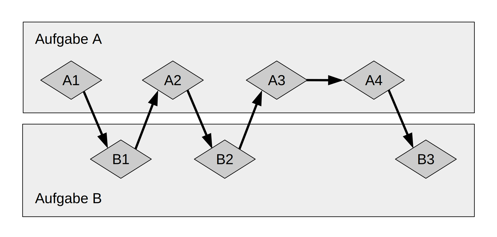
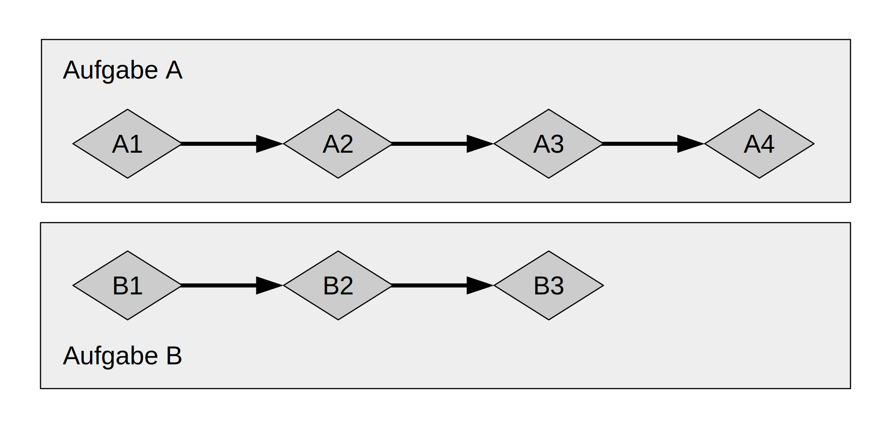

## Async und Await

Viele Operationen, die wir einen Computer durchführen lassen, können eine Weile
dauern, bis sie erledigt sind. Wenn du beispielsweise mit einem Video-Editor
ein Video einer Familienfeier exportierst, kann das Minuten bis Stunden dauern.
Auch das Herunterladen eines Videos, das jemand aus deiner Familie freigegeben
hat, kann lange dauern. Es wäre schön, wenn wir etwas anderes tun könnten,
während wir darauf warten, dass dieser langwierige Vorgang abgeschlossen wird.

Der Videoexport wird so viel CPU- und GPU-Leistung wie möglich beanspruchen.
Wenn du nur über einen CPU-Kern verfügst und dein Betriebssystem den Export nie
pausiert, bis er abgeschlossen ist, kannst du in der Zeit nichts anderes auf
deinem Computer machen. Das wäre allerdings eine ziemlich frustrierende
Erfahrung. Stattdessen kann und wird das Betriebssystem deines Computers den
Export oft genug unmerkbar unterbrechen, damit du währenddessen andere Aufgaben
erledigen kannst.

Der Dateidownload unterscheidet sich. Er beansprucht nicht sehr viel CPU-Zeit.
Stattdessen muss die CPU auf das Eintreffen der Daten aus dem Netzwerk warten.
Während du mit dem Einlesen der Daten beginnen kannst, sobald einige von ihnen
angekommen sind, kann es eine Weile dauern, bis der Rest angekommen ist. Selbst
wenn alle Daten vorhanden sind, kann ein Video recht groß sein, sodass es
einige Zeit dauern kann, bis alle Daten geladen wurden. Vielleicht dauert es
nur ein oder zwei Sekunden, aber das ist eine sehr lange Zeit für einen
modernen Prozessor, der in jeder Sekunde Milliarden von Operationen ausführen
kann. Es wäre schön, wenn man die CPU für andere Aufgaben nutzen könnte,
während man auf die Ende des Netzwerkaufrufs wartet. Auch hier unterbricht das
Betriebssystem das Programm unmerkbar, damit andere Dinge geschehen können,
während die Netzwerkoperation noch läuft.

> Hinweis: Der Videoexport ist eine Operation, die oft als „CPU-gebunden“ oder
> „rechengebunden“ bezeichnet wird. Er ist begrenzt durch die Geschwindigkeit,
> mit der der Computer Daten innerhalb der *CPU* oder *GPU* verarbeiten kann,
> und wie viel von dieser Geschwindigkeit er nutzen kann. Das Herunterladen von
> Videos ist hingegen ein Vorgang, der oft als „IO-gebunden“ bezeichnet wird,
> weil er durch die Geschwindigkeit der *Eingabe und Ausgabe* des Computers
> begrenzt ist. Es kann nur so schnell gehen, wie die Daten über das Netzwerk
> gesendet werden können.

In beiden Beispielen bieten die unmerkbaren Unterbrechungen des Betriebssystems
eine Form der Nebenläufigkeit. Diese Nebenläufigkeit findet jedoch nur auf der
Ebene eines Programms statt: Das Betriebssystem unterbricht ein Programm, damit
andere Programme ihre Arbeit erledigen können. Da wir unsere Programme in
vielen Fällen auf einer viel feineren Ebene verstehen als das Betriebssystem,
können wir viele Möglichkeiten für Nebenläufigkeit erkennen, die das
Betriebssystem nicht sehen kann.

Wenn wir beispielsweise ein Werkzeug zur Verwaltung von Dateidownloads
entwickeln, sollten wir unser Programm so schreiben können, dass der Start
eines Downloads die Benutzeroberfläche nicht blockiert, und die Benutzer
sollten mehrere Downloads gleichzeitig starten können. Viele
Betriebssystem-APIs zur Interaktion mit dem Netzwerk sind jedoch *blockierend*.
Das heißt, diese APIs blockieren den Programmfortschritt, bis die Daten, die
sie verarbeiten, vollständig verfügbar sind.

> Hinweis: So funktionieren die *meisten* Funktionsaufrufe, wenn du darüber
> nachdenkst! Wir denken beim Begriff „blockierend“ jedoch normalerweise an
> Funktionsaufrufe, die mit Dateien, dem Netzwerk oder anderen Ressourcen auf
> dem Computer interagieren, weil dies Stellen sind, an denen ein individuelles
> Programm davon profitieren würde, wenn die Operation *nicht* blockierend
> wäre.

Wir könnten das Blockieren unseres Haupt-Strangs (main thread) vermeiden, indem
wir für das Herunterladen jeder Datei einen eigenen Strang (thread) starten.
Allerdings würden wir irgendwann feststellen, dass der Overhead dieser Stränge
ein Problem darstellt. Es wäre auch besser, wenn der Aufruf gar nicht erst
blockiert würde. Und nicht zuletzt wäre es besser, wenn wir in demselben
direkten Stil schreiben könnten, den wir bei blockierendem Code verwenden. So
ähnlich wie hier:

```rust,ignore,does_not_compile
let data = fetch_data_from(url).await;
println!("{data}");
```

Genau das bietet uns die asynchrone Abstraktion von Rust. Bevor wir uns jedoch
ansehen, wie dies in der Praxis funktioniert, müssen wir einen kleinen
Abstecher zu den Unterschieden zwischen Parallelität und Nebenläufigkeit
machen.

### Parallelität und Nebenläufigkeit

Im vorigen Kapitel haben wir Parallelität und Nebenläufigkeit als weitgehend
gleichbedeutend behandelt. Jetzt müssen wir genauer zwischen ihnen
unterscheiden, denn die Unterschiede werden sich bei der Arbeit zeigen.

Schauen wir uns verschiedene Möglichkeiten an, wie ein Team die Arbeit an einem
Softwareprojekt aufteilen kann. Wir könnten einer einzelnen Person mehrere
Aufgaben zuweisen, oder wir könnten jedem Teammitglied eine Aufgabe zuweisen,
oder wir könnten eine Mischung aus beiden Ansätzen wählen.

Wenn eine Person an mehreren verschiedenen Aufgaben arbeitet, bevor eine von
ihnen abgeschlossen ist, handelt es sich um *Nebenläufigkeit*. Vielleicht hast
du zwei verschiedene Projekte auf deinem Computer ausgecheckt, und wenn dir bei
einem Projekt langweilig wird oder du nicht weiterkommst, wechsle zum anderen.
Da du nur eine Person bist, kannst du nicht an beiden Aufgaben gleichzeitig
arbeiten, aber du kannst Multitasking betreiben, d.h. du kannst an mehreren
Aufgaben arbeiten, indem du zwischen ihnen wechselst.



<span class="caption">Abbildung 17-1: Ein nebenläufiger Arbeitsablauf, der
zwischen Aufgabe A und Aufgabe B wechselt.</span>

Wenn man sich darauf einigt, eine Gruppe von Aufgaben unter den Teammitgliedern
aufzuteilen, wobei jede Person eine Aufgabe übernimmt und allein bearbeitet,
ist das *Parallelität*. Jede Person im Team kann genau zur gleichen Zeit
Fortschritte machen.



<span class="caption">Abbildung 17-2: Ein paralleler Arbeitsablauf, bei dem die
Arbeit an Aufgabe A und Aufgabe B unabhängig voneinander erfolgt.</span>

In diesen beiden Situationen musst du dich möglicherweise zwischen
verschiedenen Aufgaben abstimmen. Vielleicht hast du *gedacht*, dass die
Aufgabe, an der eine Person arbeitet, völlig unabhängig von der Arbeit der
anderen ist, aber sie muss von einer anderen Person im Team erledigt werden.
Ein Teil der Arbeit könnte parallel erledigt werden, aber ein Teil der Arbeit
war eigentlich *sequentiell*: Sie konnte nur nacheinander stattfinden, eins
nach dem anderen, wie in Abbildung 17-3.


<span class="caption">Abbildung 17-3: Ein teilweise paralleler Arbeitsablauf,
bei dem die Arbeit an Aufgabe A und Aufgabe B unabhängig voneinander erfolgt,
bis Aufgabe A3 durch die Ergebnisse von Aufgabe B3 blockiert wird.</span>

Ebenso könntest du feststellen, dass eine deiner eigenen Aufgaben von einer
anderen deiner Aufgaben abhängt. Jetzt ist deine gleichzeitige Arbeit auch
sequentiell geworden.

Parallelität und Nebenläufigkeit können sich auch gegenseitig überschneiden.
Wenn du erfährst, dass ein Kollege nicht weiterkommt, bis du eine deiner
Aufgaben beendet hast, wirst du dich wahrscheinlich ganz auf diese Aufgabe
konzentrieren, um deinen Kollegen nicht zu blockieren. Du und dein Kollege
können nicht mehr parallel arbeiten, und du könntest auch nicht mehr
nebenläufig an deinen eigenen Aufgaben arbeiten.

Die gleiche grundlegende Dynamik kommt bei Software und Hardware zum Tragen.
Auf einem Rechner mit einem einzigen CPU-Kern kann die CPU nur eine Operation
zur gleichen Zeit ausführen, aber sie kann dennoch nebenläufig arbeiten.
Mithilfe von Werkzeugen wie Strängen, Prozessen und async kann der Computer
eine Aktivität unterbrechen und zu einer anderen wechseln, bis er schließlich
wieder zur ersten Aktivität zurückkehrt. Auf einem Computer mit mehreren
CPU-Kernen kann er auch parallel arbeiten. Ein Kern kann eine Sache erledigen,
während ein anderer Kern etwas völlig anderes tut, und das sogar zur gleichen
Zeit.

Wenn wir mit async in Rust arbeiten, haben wir es immer mit Nebenläufigkeit zu
tun. Abhängig von der Hardware, dem Betriebssystem und der verwendeten
asynchronen Laufzeitumgebung kann diese Nebenläufigkeit auch Parallelität unter
der Haube nutzen.

Jetzt wollen wir uns ansehen, wie die asynchrone Programmierung in Rust
tatsächlich funktioniert! Im weiteren Verlauf dieses Kapitels werden wir:

* sehen, wie man Rusts `async` und `await` Syntax verwendet
* erkunden, wie man das asynchrone Modell verwendet, um einige der
  Herausforderungen zu lösen, die wir in Kapitel 16 betrachtet haben
* uns anschauen, wie Mehrsträngigkeit (multithreading) und async komplementäre
  Lösungen bieten, die man in vielen Fällen sogar zusammen verwenden kann
