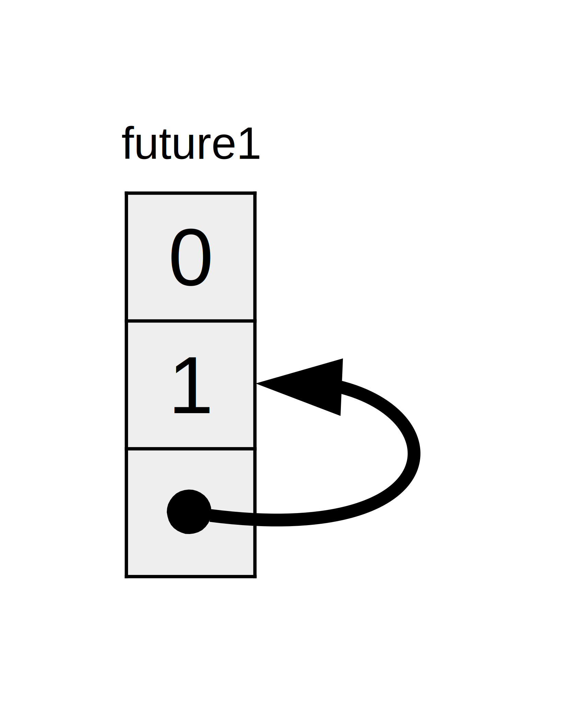
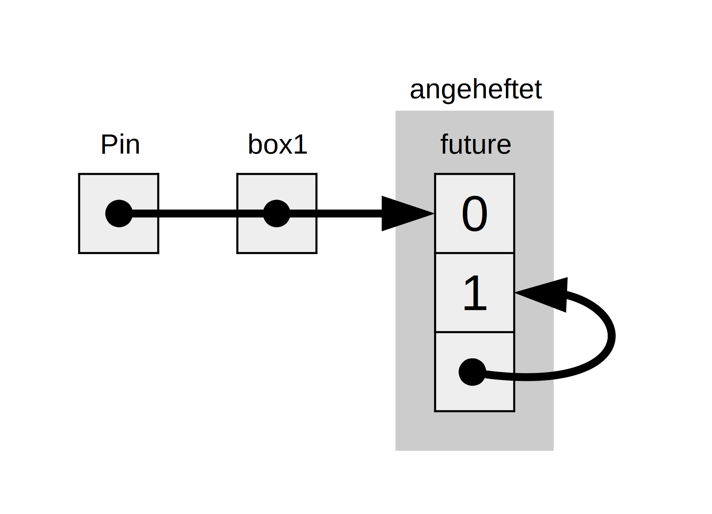
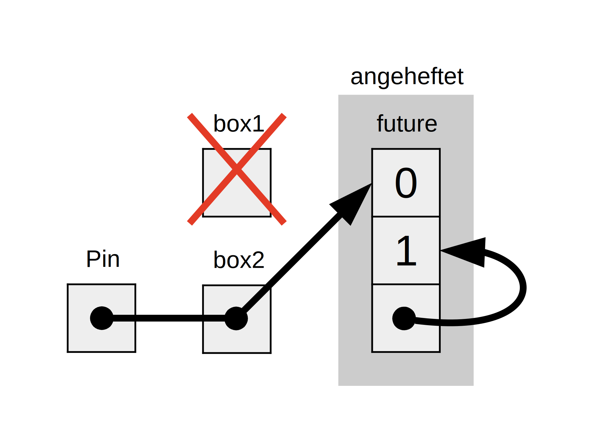
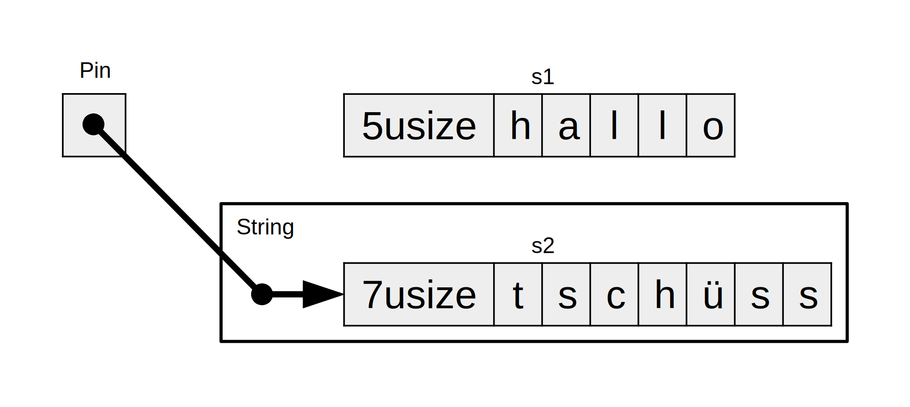

## Merkmale für async

Im Laufe des Kapitels haben wir die Merkmale `Future`, `Pin`, `Unpin`, `Stream`
und `StreamExt` auf verschiedene Weise verwendet. Bis jetzt haben wir es jedoch
vermieden, zu sehr ins Detail zu gehen, wie sie funktionieren oder wie sie
zusammenpassen. Wenn wir Rust für den Alltag schreiben, ist das meist
ausreichend. Manchmal stößt man jedoch auf Situationen, in denen es wichtig
ist, ein paar mehr dieser Details zu verstehen. In diesem Abschnitt gehen wir
*noch* weiter in die Tiefe, um dir in solchen Situationen zu helfen &ndash;
und überlassen die *wirklich* tiefen Einblicke der weiteren Dokumentation!

### Future

Im Abschnitt [„Futures und die asynchrone Syntax“][futures-syntax] haben wir
bereits festgestellt, dass `Future` ein Merkmal ist. Lass uns zunächst einen
genaueren Blick darauf werfen, wie es funktioniert. Rust definiert ein `Future`
wie folgt:

```rust
use std::pin::Pin;
use std::task::{Context, Poll};

pub trait Future {
    type Output;

    fn poll(self: Pin<&mut Self>, cx: &mut Context<'_>) -> Poll<Self::Output>;
}
```

Diese Merkmals-Definition enthält eine Reihe neuer Typen und auch eine Syntax,
die wir bisher noch nicht gesehen haben. Gehen wir also die Definition Stück
für Stück durch.

Erstens gibt der zugehörige Typ `Output` von `Future` an, was das Future
zurückgibt. Dies ist analog zum Typ `Item` des Merkmals `Iterator`. Zweitens
hat `Future` auch die Methode `poll`, die eine spezielle `Pin`-Referenz für
ihren `self`-Parameter und eine veränderbare Referenz auf einen `Context`-Typ
entgegennimmt und `Poll<Self::Output>` zurückgibt. Wir werden später in diesem
Abschnitt ein wenig mehr über `Pin` und `Context` sprechen. Für den Moment
wollen wir uns auf das konzentrieren, was die Methode zurückgibt: Den Typ
`Poll`:

```rust
enum Poll<T> {
    Ready(T),
    Pending,
}
```

Dieser Typ `Poll` ist ähnlich wie eine `Option`: Er hat eine Variante
`Ready(T)`, die einen Wert hat, und eine Variante `Pending` ohne Wert. Sie
bedeutet jedoch etwas ganz anderes! Die Variante `Pending` zeigt an, dass das
Future noch Arbeit zu erledigen hat, sodass der Aufrufer später noch einmal
nachsehen muss. Die Variante `Ready` zeigt an, dass das `Future` seine Arbeit
beendet hat und der Wert `T` verfügbar ist.

> Hinweis: Bei den meisten Futures sollte der Aufrufer die Methode `poll` nicht
> erneut aufrufen, nachdem das Future `Ready` zurückgegeben hat. Viele Futures
> werden das Programm abbrechen, wenn sie erneut abgefragt werden, obwohl sie
> bereit sind! Futures, bei denen eine erneute Abfrage sicher ist, werden dies
> in ihrer Dokumentation explizit erwähnen. Dies ist ähnlich zum Verhalten von
> `Iterator::next`!

Unter der Haube kompiliert Rust Code mit `await` zu Code, der `poll` aufruft.
Wenn du dir Codeblock 17-4 ansiehst, wo wir den Seitentitel für eine einzelne
URL ausgegeben haben, sobald sie aufgelöst wurde, kompiliert Rust das in etwa
(wenn auch nicht genau) wie folgt:

```rust,ignore
match page_title(url).poll() {
    Ready(page_title) => match page_title {
        Some(title) => println!("Der Titel für {url} war {title}"),
        None => println!("{url} hatte keinen Titel"),
    }
    Pending => {
        // Aber was kommt hierhin?
    }
}
```

Was sollen wir tun, wenn das `Future` noch `Pending` ist? Wir brauchen eine
Möglichkeit, es nochmal zu versuchen und nochmal und nochmal, bis das Future
endlich fertig ist. Mit anderen Worten, eine Schleife:

```rust,ignore
let mut page_title_fut = page_title(url);
loop {
    match page_title_fut.poll() {
        Ready(value) => match page_title {
            Some(title) => println!("Der Titel für {url} war {title}"),
            None => println!("{url} hatte keinen Titel"),
        }
        Pending => {
            // weitermachen
        }
    }
}
```

Wenn Rust diesen Code kompilieren würde, würde jedes `await` blockieren &ndash;
genau das Gegenteil von dem, was wir erreichen wollten! Stattdessen sorgt Rust
dafür, dass die Schleife die Kontrolle an etwas abgeben kann, das die Arbeit an
diesem Future unterbrechen und an anderen Futures arbeiten kann, um diese
später wieder zu prüfen. Dieses „Etwas“ ist eine asynchrone Laufzeitumgebung,
und diese Planungs- und Koordinierungsarbeit ist eine der Hauptaufgaben einer
Laufzeitumgebung.

Erinnere dich an unsere Beschreibung (im Abschnitt [„Zählen“][counting]) zum
Warten auf `rx.recv`. Der Aufruf `recv` gibt ein `Future` zurück und zum
Warten darauf wird es es abgefragt. In unserer anfänglichen Diskussion haben
wir angemerkt, dass eine Laufzeitumgebung das Future pausieren wird, bis es
entweder mit `Some(message)` oder `None` bereit ist, wenn der Kanal
geschlossen wird. Mit unserem tieferen Verständnis von `Future` und
insbesondere von `Future::poll` können wir sehen, wie das funktioniert. Die
Laufzeitumgebung weiß, dass das Future nicht bereit ist, wenn es
`Poll::Pending` zurückgibt. Umgekehrt weiß die Laufzeitumgebung, dass das
Future bereit ist und bevorzugt es, wenn `poll` den Wert
`Poll::Ready(Some(message))` oder `Poll::Ready(None)` zurückgibt.

Die genauen Details, wie eine Laufzeitumgebung das macht, gehen über das
hinaus, was wir in diesem Abschnitt behandeln können. Der Schlüssel dazu ist
die grundlegende Mechanik von Futures: Eine Laufzeitumgebung *fragt* jedes
Zukunft ab, für die es verantwortlich ist, und legt es zurück in den Schlaf,
wenn es noch nicht bereit ist.

### Anheften (pinning) und die Merkmale Pin und Unpin

Als wir bei der Arbeit an Codeblock 17-16 die Idee des Anheftens einführten,
stießen wir auf eine sehr unangenehme Fehlermeldung. Hier ist noch einmal der
relevante Teil davon:

```text
error[E0277]: `{async block@src/main.rs:10:23: 10:33}` cannot be unpinned
  --> src/main.rs:48:33
   |
48 |         trpl::join_all(futures).await;
   |                                 ^^^^^ the trait `Unpin` is not implemented for `{async block@src/main.rs:10:23: 10:33}`, which is required by `Box<{async block@src/main.rs:10:23: 10:33}>: Future`
   |
   = note: consider using the `pin!` macro
           consider using `Box::pin` if you need to access the pinned value outside of the current scope
   = note: required for `Box<{async block@src/main.rs:10:23: 10:33}>` to implement `Future`
note: required by a bound in `futures_util::future::join_all::JoinAll`
  --> file:///home/.cargo/registry/src/index.crates.io-6f17d22bba15001f/futures-util-0.3.30/src/future/join_all.rs:29:8
   |
27 | pub struct JoinAll<F>
   |            ------- required by a bound in this struct
28 | where
29 |     F: Future,
   |        ^^^^^^ required by this bound in `JoinAll`
```

Wenn wir diese Fehlermeldung aufmerksam lesen, sagt sie uns nicht nur, dass wir
die Werte anheften müssen, sondern auch, warum das Anheften erforderlich ist.
Die Funktion `trpl::join_all` gibt eine Struktur namens `JoinAll` zurück. Diese
Struktur ist generisch über einen Typ `F`, der auf die Implementierung des
Merkmals `Future` beschränkt ist. Direktes Warten auf ein Future mit `await`
heftet das Future implizit an. Deshalb müssen wir `pin!` nicht überall
verwenden, wo wir auf Futures warten wollen.

Allerdings warten wir hier nicht direkt ein Future. Stattdessen konstruieren
wir ein neues Future `JoinAll`, indem wir eine Kollektion von Futures an die
Funktion `join_all` übergeben. Die Signatur für `join_all` erfordert, dass der
Typ der Elemente in der Kollektion das Merkmal `Future` implementiert. `Box<T>`
implementiert `Future` nur, wenn das `T`, das es umhüllt, ein Future ist, das
das Merkmal `Unpin` implementiert.

Das ist eine ganze Menge! Aber wir können es verstehen, wenn wir ein wenig
tiefer in die Funktionsweise des Typs `Future` eintauchen, insbesondere im
Zusammenhang mit *Anheften*.

Schauen wir uns noch einmal die Definition von `Future` an:

```rust
use std::pin::Pin;
use std::task::{Context, Poll};

pub trait Future {
    type Output;

    // Erforderliche Methode
    fn poll(self: Pin<&mut Self>, cx: &mut Context<'_>) -> Poll<Self::Output>;
}
```

Der Parameter `cx` und sein Typ `Context` sind der Schlüssel dazu, wie eine
Laufzeitumgebung tatsächlich weiß, wann sie ein bestimmtes Future prüfen muss,
während es immer noch faul ist. Die Details, wie das funktioniert, liegen
jedoch außerhalb des Rahmens dieses Kapitels: Du musst dich im Allgemeinen nur
darum kümmern, wenn du eine eigene `Future`-Implementierung schreibst.

Stattdessen konzentrieren wir uns auf den Typ für `self`. Dies ist das erste
Mal, dass wir eine Methode sehen, bei der `self` eine Typ-Annotation hat. Eine
Typ-Annotation für `self` ist ähnlich wie Typ-Annotationen für andere
Funktionsparameter, mit zwei wesentlichen Unterschieden. Erstens, wenn wir den
Typ von `self` auf diese Weise angeben, teilen wir Rust mit, welchen Typ `self`
haben muss, um diese Methode aufzurufen. Zweitens kann eine Typ-Annotation auf
`self` nicht einfach irgendein Typ sein. Es darf nur der Typ sein, auf dem die
Methode implementiert ist, ein Referenz oder intelligenter Zeiger auf diesen
Typ oder ein `Pin`, der eine Referenz auf diesen Typ umschließt. Wir werden
mehr über diese Syntax in Kapitel 18 sehen. Für den Moment reicht es zu wissen,
dass wir, wenn wir ein Future abfragen wollen (um zu prüfen, ob es `Pending`
oder `Ready(Output)` ist), eine veränderbare Referenz auf den Typ benötigen,
der in ein `Pin` eingepackt ist.

`Pin` ist ein Wrapper-Typ. In gewisser Weise ähnelt er den Typen `Box`, `Rc`
und anderen intelligenten Zeigern, die wir in Kapitel 15 gesehen haben und die
ebenfalls andere Typen umschließen. Im Gegensatz zu diesen funktioniert `Pin`
jedoch nur mit *Zeigertypen* wie Referenzen (`&` und `&mut`) und intelligenten
Zeigern (`Box`, `Rc` usw.). Um genau zu sein, funktioniert `Pin` mit Typen, die
das Merkmal `Deref` oder `DerefMut` implementieren, die wir in Kapitel 15
behandelt haben. Man kann sich diese Einschränkung so vorstellen, als würde man
nur mit Zeigern arbeiten, weil die Implementierung von `Deref` oder `DerefMut`
bedeutet, dass sich dein Typ ähnlich wie ein Zeigertyp verhält. `Pin` ist auch
selbst kein Zeiger und hat kein eigenes Verhalten, wie es `Rc` und `Arc` mit
Referenzzählern haben. Es ist lediglich ein Werkzeug, das der Compiler
verwenden kann, um die relevanten Garantien aufrechtzuerhalten, indem er Zeiger
mit dem Typ umschließt.

Wenn man sich daran erinnert, dass `await` in Form von Aufrufen von `poll`
implementiert ist, erklärt das die Fehlermeldung, die wir oben gesehen haben
&ndash; aber die bezog sich auf `Unpin`, nicht auf `Pin`. Was genau sind also
`Pin` und `Unpin`, wie hängen sie zusammen, und warum muss `Future` in einem
`Pin`-Typ sein, um `poll` aufzurufen?

In [„Unser erstes asynchrones Programm“][first-async] haben wir beschrieben,
wie eine Reihe von Wartepunkten in einem Future zu einem Zustandsautomaten
kompiliert wird &ndash; und wie der Compiler dafür sorgt, dass dieser
Zustandsautomat alle normalen Sicherheitsregeln von Rust befolgt,
einschließlich Ausleihen (borrowing) und Eigentümerschaft (ownership). Damit
das funktioniert, prüft Rust, welche Daten zwischen einem await-Punkt und dem
nächsten oder dem Ende des asynchronen Blocks benötigt werden. Dann wird eine
entsprechende Variante in dem von ihm erstellten Zustandsautomaten erstellt.
Jede Variante erhält den erforderlichen Zugriff auf die Daten, die in diesem
Abschnitt des Quellcodes verwendet werden, entweder durch Übernahme der
Eigentümerschaft an diesen Daten oder durch Erhalt einer veränderbaren oder
unveränderbaren Referenz darauf.

So weit, so gut: Wenn wir bei der Eigentümerschaft oder den Referenzen in einem
bestimmten asynchronen Block etwas falsch machen, wird uns der Ausleihenprüfer
(borrow checker) dies mitteilen. Wenn wir das Future, das diesem Block
entspricht, verschieben wollen &ndash; etwa in einen `Vec`, um es an `join_all`
zu übergeben, wie wir es im Abschnitt [„Arbeiten mit einer beliebigen Anzahl
von Futures“][any-number-futures] getan haben &ndash;, wird es schwieriger.

Wenn wir ein Future verschieben &ndash; sei es durch Verschieben in eine
Datenstruktur, um es als Iterator mit `join_all` zu verwenden oder durch
Rückgabe aus einer Funktion &ndash; bedeutet das eigentlich, dass wir die
Zustandsmaschine verschieben, die Rust für uns erstellt. Und im Gegensatz zu
den meisten anderen Typen in Rust können die Futures, die Rust für async-Blöcke
erzeugt, mit Referenzen auf sich selbst in den Feldern einer beliebigen
Variante enden, wie in Codeblock 17-4 zu sehen ist (eine vereinfachte
Illustration, die dir helfen soll, ein Gefühl für die Idee zu bekommen,
anstatt sich in die oft recht komplizierten Details zu vertiefen).



<figcaption>Abbildung 17-4: Ein selbstreferenzierender Datentyp</figcaption>

Standardmäßig kann ein Objekt, das eine Referenz auf sich selbst hat, nicht
sicher verschoben werden, da Referenzen immer auf die tatsächliche
Speicheradresse des Objekts zeigen. Wenn du die Datenstruktur selbst
verschiebst, verweisen diese internen Referenzen weiterhin auf den alten
Speicherplatz. Dieser Speicherplatz ist nun jedoch ungültig. Zum einen wird ihr
Wert nicht mehr aktualisiert, wenn du Änderungen an der Datenstruktur
vornimmst. Zum anderen &ndash; und das ist noch wichtiger &ndash; kann der
Computer diesen Speicherplatz nun für andere Dinge verwenden! Es könnte sein,
dass du später völlig unzusammenhängende Daten liest.


<figcaption>Abbildung 17-5: Das unsichere Ergebnis beim Verschieben eines
selbstreferenzierenden Datentyps</figcaption>

Im Prinzip könnte der Rust-Compiler versuchen, jede Referenz auf ein Objekt
jedes Mal zu aktualisieren, wenn es verschoben wird. Das wäre potenziell eine
Menge Performance-Overhead, vor allem wenn man bedenkt, dass es ein ganzes Netz
von Referenzen geben kann, die aktualisiert werden müssen. Wenn wir
andererseits sicherstellen können, dass die betreffende Datenstruktur *nicht im
Speicher verschoben wird*, müssen wir keine Referenzen aktualisieren. Das ist
genau das, was der Rust-Ausleihenprüfer verlangt: Man kann ein Element, auf das
aktive Referenzen bestehen, nicht mit sicherem Code verschieben.

`Pin` baut darauf auf, um uns genau die Garantie zu geben, die wir brauchen.
Wenn wir einen Wert *anheften*, indem wir einen Zeiger auf diesen Wert in `Pin`
einpacken, kann er nicht mehr verschoben werden. Wenn du also
`Pin<Box<SomeType>>` hast, heftest du eigentlich den Wert `SomeType` an,
*nicht* den Zeiger `Box`. Abbildung 17-6 veranschaulicht dies:



<figcaption>Abbildung 17-6: Anheften einer `Box`, die auf einen
selbstreferenzierenden Future-Typ zeigt</figcaption>

In der Tat kann der Zeiger in `Box` immer noch verschoben werden. Denke daran:
Wir wollen sicherstellen, dass die Daten, auf die letztlich referenziert wird,
an ihrem Platz bleiben. Wenn ein Zeiger verschoben wird, aber die Daten, auf
die er zeigt, an der gleichen Stelle sind, wie in Abbildung 17-7, gibt es kein
potenzielles Problem. (Wie man das mit `Pin`, der ein `Box` umschließt, macht
ist mehr, als wir in dieser speziellen Diskussion behandeln werden. Aber es
wäre eine gute Übung! Wenn du dir die Dokumentationen der Typen und des Moduls
`std::pin` ansiehst, kannst du vielleicht herausfinden, wie du das machen
würdest.) Der Schlüssel ist, dass der selbstreferenzierende Typ selbst nicht
verschoben werden kann, weil er immer noch angeheftet ist.



<figcaption>Figure 17-7: Verschieben einer `Box`, die auf einen
selbstreferenzierenden Futuretyp zeigt.</figcaption>

Die meisten Typen können jedoch gefahrlos verschoben werden, selbst wenn sie
sich hinter einem `Pin`-Zeiger befinden. Wir müssen nur über das Anheften
nachdenken, wenn Elemente interne Referenzen haben. Primitive Werte wie Zahlen
und Boolesche Werte haben keine internen Referenzen, also sind sie
offensichtlich sicher. Genauso wenig wie die meisten Typen, mit denen man
normalerweise in Rust arbeitet. Ein `Vec` zum Beispiel hat keine internen
Referenzen, die er aktuell halten muss, sodass du ihn unbesorgt verschieben
kannst. Wenn du einen `Pin<Vec<String>>` hast, musst du alles über die
sicheren, aber restriktiven APIs von `Pin` machen, obwohl ein `Vec<String>`
immer sicher verschoben werden kann, wenn es keine anderen Referenzen darauf
gibt. Wir brauchen eine Möglichkeit, dem Compiler mitzuteilen, dass es
eigentlich in Ordnung ist, Elemente in solchen Fällen zu verschieben. Dafür
gibt es `Unpin`.

`Unpin` ist ein Markierungsmerkmal (marker trait), ähnlich wie die Merkmale
`Send` und `Sync`, die wir in Kapitel 16 gesehen haben. Erinnere dich, dass
Markierungsmerkmale keine eigene Funktionalität haben. Sie existieren nur, um
dem Compiler mitzuteilen, dass es sicher ist, den Typ zu verwenden, der ein
bestimmtes Merkmal in einem bestimmten Kontext implementiert. `Unpin` teilt dem
Compiler mit, dass ein gegebener Typ *keine* besonderen Garantien
aufrechterhalten muss, um den fragliche Wert zu verschieben.

Genau wie bei `Send` und `Sync` implementiert der Compiler `Unpin` automatisch
für alle Typen, bei denen er beweisen kann, dass sie sicher sind. Der
Sonderfall, wiederum analog zu bei `Send` und `Sync`, ist der Fall, dass
`Unpin` für einen Typ *nicht* implementiert ist. Die Notation hierfür ist `impl
 !Unpin for SomeType`, wobei `SomeType` der Name eines Typs ist, der diese
Garantien aufrechterhalten *muss*, um sicher zu sein, wenn ein Zeiger auf
diesen Typ in einem `Pin` verwendet wird.

Mit anderen Worten, es gibt zwei Dinge über die Beziehung zwischen `Pin` und
`Unpin` zu beachten. Erstens ist `Unpin` der „normale“ Fall, und `!Unpin` der
Spezialfall. Zweitens, ob ein Typ `Unpin` oder `!Unpin` implementiert, spielt
*nur* eine Rolle, wenn man einen angepinnten Zeiger auf diesen Typ wie
`Pin<&mut SomeType>` verwendet.

Um dies zu verdeutlichen, denke an einen `String`: Er hat eine Länge und die
Unicode-Zeichen, aus denen er besteht. Wir können einen `String` in einen `Pin`
einpacken, wie in Abbildung 17-8. Allerdings implementiert `String` automatisch
`Unpin`, genau wie die meisten anderen Typen in Rust.


<figcaption>Abbildung 17-8: Anheften einer Zeichenkette; die gepunkteten Linie
deutet an, dass die Zeichenkette das Merkmal `Unpin` implementiert und daher
nicht angeheftet ist.</figcaption>

Infolgedessen können wir Dinge tun, die illegal wären, wenn `String`
stattdessen `!Unpin` implementiert hätte, wie zum Beispiel das Ersetzen einer
Zeichenkette durch eine andere an der exakt gleichen Stelle im Speicher, wie in
Abbildung 17-9. Dies verletzt nicht den `Pin`-Vertrag, weil `String` keine
internen Referenzen hat, die es unsicher machen, es zu verschieben! Das ist
genau der Grund, warum es `Unpin` und nicht `!Unpin` implementiert.



<figcaption>Figure 17-9: Ersetzen der Zeichenkette durch eine völlig andere
Zeichenkette im Speicher.</figcaption>

Jetzt wissen wir genug, um die Fehler zu verstehen, die für den Aufruf
`join_all` in Codeblock 17-17 gemeldet wurden. Ursprünglich haben wir versucht,
die von asynchronen Blöcken erzeugten Futures in einen `Vec<Box<dyn
 Future<Output = ()>>>` zu verschieben, aber wie wir gesehen haben, können
diese Futures interne Referenzen haben, sodass sie `Unpin` nicht
implementieren. Sie müssen angepinnt werden und dann können wir den Typ `Pin`
an den `Vec` übergeben, in der Gewissheit, dass die zugrunde liegenden Daten in
den Futures *nicht* verschoben werden.

`Pin` und `Unpin` sind vor allem für die Erstellung von Bibliotheken auf
niedrigerer Ebene wichtig und wenn du eine Laufzeitumgebung erstellst, weniger
für den alltäglichen Rust-Code. Wenn du diese Merkmale in Fehlermeldungen
siehst, hast du jetzt eine bessere Vorstellung davon, wie du den Code
korrigieren kannst!

> Anmerkung: Diese Kombination von `Pin` und `Unpin` erlaubt es, eine ganze
> Klasse komplexer Typen in Rust sicher zu machen, die sonst schwer zu
> implementieren sind, weil sie selbstreferenzierend sind. Typen, die `Pin`
> benötigen, tauchen heute *am häufigsten* in asynchronem Rust auf, aber man
> kann sie &ndash; sehr selten &ndash; auch in anderen Kontexten sehen.
>
> Die Besonderheiten der Funktionsweise von `Pin` und `Unpin` und die Regeln,
> die sie einhalten müssen, werden ausführlich in der API-Dokumentation für
> `std::pin` behandelt. Wenn du also tiefer in die Materie einsteigen willst,
> ist das ein guter Ausgangspunkt.
>
> Wenn du noch detaillierter verstehen willst, wie die Dinge „unter der Haube“
> funktionieren, ist das offizielle Buch [_Asynchronous Programming
> in Rust_][async-book] genau das Richtige für dich:
>
> - [Kapitel 2: Under the Hood: Executing Futures and Tasks][under-the-hood]
> - [Kapitel 4: Pinning][pinning]

### Das Merkmal `Stream`

Nachdem wir nun ein tieferes Verständnis für die Merkmale `Future`, `Pin` und
`Unpin` haben, können wir uns dem Merkmal `Stream` zuwenden. Wie im Abschnitt
zu Strömen beschrieben, sind Ströme ähnlich wie asynchrone Iteratoren. Im
Gegensatz zu `Iterator` und `Future` gibt es zum aktuellen Zeitpunkt keine
Definition des Merkmals `Stream` in der Standardbibliothek, aber es *gibt* eine
sehr verbreitete Definition in der Kiste `Futures`, die im gesamten Ökosystem
verwendet wird.

Schauen wir uns die Definitionen der Merkmale `Iterator` und `Future` an, damit
wir darauf aufbauen können, wie ein Merkmal `Stream` aussehen könnte. Von
`Iterator` haben wir die Idee einer Sequenz: Seine Methode `next` liefert eine
`Option<Self::Item>`. Von `Future` haben wir die Idee der zeitlichen
Bereitschaft: Seine Methode `poll` liefert ein `Poll<Self::Output>`. Um eine
Sequenz von Elementen darzustellen, die im Laufe der Zeit bereit sind,
definieren wir ein Merkmal `Stream`, das diese Funktionalitäten zusammenführt:

```rust
use std::pin::Pin;
use std::task::{Context, Poll};

trait Stream {
    type Item;

    fn poll_next(
        self: Pin<&mut Self>,
        cx: &mut Context<'_>
    ) -> Poll<Option<Self::Item>>;
}
```

Das Merkmal `Stream` definiert einen zugehörigen Typ `Item` für den Typ der vom
Strom erzeugten Elemente. Dies ist ähnlich wie bei `Iterator`: Es kann null bis
viele davon geben, anders als bei `Future`, wo es immer nur einen einzigen
`Output` gibt (selbst wenn es der Einheitstyp `()` ist).

`Stream` definiert auch eine Methode zum Abrufen dieser Elemente. Wir nennen
sie `poll_next`, um zu verdeutlichen, dass sie auf die gleiche Weise wie
`Future::poll` abfragt und eine Sequenz von Elementen auf die gleiche Weise wie
`Iterator::next` erzeugt. Sein Rückgabetyp kombiniert `Poll` mit `Option`. Der
äußere Typ ist `Poll`, weil er auf Bereitschaft geprüft werden muss, genau wie
ein Future. Der innere Typ ist `Option`, weil er signalisieren muss, ob es
weitere Nachrichten gibt, genau wie ein Iterator.

Etwas, das dem sehr ähnlich ist, wird wahrscheinlich als Teil der
Standardbibliothek von Rust standardisiert werden. In der Zwischenzeit ist es
Teil des Werkzeugkoffers der meisten Laufzeitumgebungen, sodass du dich darauf
verlassen kannst, und alles, was wir unten behandeln, sollte im Allgemeinen
gelten!

Im Beispiel, das wir im Abschnitt über Ströme gesehen haben, haben wir
allerdings nicht `poll_next` *oder* `Stream` benutzt, sondern `next` und
`StreamExt`. Wir *könnten* direkt mit der `poll_next`-API arbeiten, indem wir
unsere eigenen `Stream`-Zustandsautomaten schreiben, genauso wie wir mit
Futures direkt über deren Methode `poll` arbeiten *können*. Die Verwendung von
`await` ist jedoch viel schöner, daher liefert das Merkmal `StreamExt` die
Methode `next`, sodass wir genau das tun können.

```rust
# use std::pin::Pin;
# use std::task::{Context, Poll};
#
# trait Stream {
#     type Item;
#     fn poll_next(
#         self: Pin<&mut Self>,
#         cx: &mut Context<'_>,
#     ) -> Poll<Option<Self::Item>>;
# }
#
trait StreamExt: Stream {
    async fn next(&mut self) -> Option<Self::Item>
    where
        Self: Unpin;

    // andere Methoden ...
}
```

> Anmerkung: Die tatsächliche Definition von `StreamExt` sieht etwas anders
> aus, da sie Versionen von Rust unterstützt, die noch keine Verwendung von
> asynchronen Funktionen in Merkmalen kennen. Infolgedessen sieht sie so aus:
>
> ```rust,ignore
> fn next(&mut self) -> Next<'_, Self> where Self: Unpin;
> ```
>
> Dieser Typ `Next` ist ein `struct`, das `Future` implementiert und eine
> Möglichkeit bietet, die Lebensdauer der Referenz auf `self` mit `Next<'_,
> Self>` zu benennen, sodass `await` mit dieser Methode arbeiten kann!

Das Merkmal `StreamExt` ist auch die Heimat aller interessanten Methoden, die
für die Verwendung mit Strömen zur Verfügung stehen. `StreamExt` wird
automatisch für jeden Typ implementiert, der `Stream` implementiert. Aber diese
Merkmale sind separat definiert, damit die Rust-Gemeinschaft das grundlegende
Merkmal getrennt von den Komfort-APIs bearbeiten kann.

In der Version von `StreamExt`, die in der Kiste `trpl` verwendet wird,
definiert das Merkmal nicht nur die Methode `next`, sondern liefert auch eine
Implementierung von `next`, die die Details des Aufrufs von `Stream::poll_next`
korrekt behandelt. Das bedeutet, dass du selbst beim Schreiben deines eigenen
Streaming-Datentyps *nur* `Stream` implementieren musst, und dann kann jeder,
der deinen Datentyp verwendet, `StreamExt` und seine Methoden automatisch mit
ihm verwenden.

Das ist alles, was wir für die tieferen Details zu diesen Merkmalen behandeln
werden. Zum Abschluss wollen wir uns ansehen, wie Futures (einschließlich
Ströme), Aufgaben und Stränge zusammenpassen!

[any-number-futures]: ch17-03-more-futures.html
[async-book]: https://rust-lang.github.io/async-book/
[counting]: ch17-02-concurrency-with-async.html
[first-async]: ch17-01-futures-and-syntax.html#unser-erstes-asynchrones-programm
[futures-syntax]: ch17-01-futures-and-syntax.html
[pinning]: https://rust-lang.github.io/async-book/04_pinning/01_chapter.html
[under-the-hood]: https://rust-lang.github.io/async-book/02_execution/01_chapter.html
