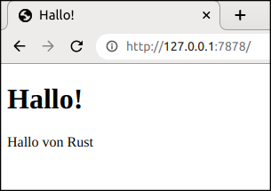

# Abschlussprojekt: Einen mehrsträngigen (multi-threaded) Webserver erstellen

Es war eine lange Reise, aber wir haben das Ende des Buches erreicht. In diesem
Kapitel werden wir gemeinsam ein weiteres Projekt aufbauen, um einige der
Konzepte zu demonstrieren, die wir in den letzten Kapiteln behandelt haben, und
einige frühere Lektionen zusammenfassen.

Für unser Abschlussprojekt werden wir einen Webserver erstellen, der „Hallo!“
sagt und in einem Webbrowser wie Abbildung 21-1 aussieht.

Hier ist unser Plan zum Bauen des Webservers:

1. Lerne ein wenig über TCP und HTTP.
2. Lausche auf TCP-Verbindungen an einem Netzwerkknoten (socket).
3. Parse eine kleine Anzahl von HTTP-Anfragen.
4. Erstelle eine korrekte HTTP-Antwort.
5. Verbessere den Durchsatz unseres Servers mit einem Strang-Vorrat (thread
   pool).

Abbildung 21-1: Unser letztes gemeinsames Projekt

Bevor wir anfangen, sollten wir ein Detail erwähnen. Die Methode, die wir
verwenden werden, wird nicht der beste Weg sein, einen Webserver mit Rust zu
bauen. Gemeinschaftsmitglieder haben eine Reihe von produktionsreifen Kisten
auf [crates.io][crates] veröffentlicht, die umfassendere Webserver- und
Strang-Vorrats-Implementierungen bereitstellen, als wir sie bauen werden.
Unsere Absicht in diesem Kapitel ist es jedoch, dir beim Lernen zu helfen, und
nicht, den einfachen Weg zu gehen. Da es sich bei Rust um eine
Systemprogrammiersprache handelt, können wir die Abstraktionsebene wählen, mit
der wir arbeiten wollen, und können auf eine niedrigere Ebene gehen, als dies
in anderen Sprachen möglich oder zweckmäßig ist. Wir werden daher den
grundlegenden HTTP-Server und den Strang-Vorrat manuell schreiben, damit du die
allgemeinen Ideen und Techniken hinter den Kisten lernst, die du in Zukunft
verwenden kannst.

[crates]: https://crates.io/
